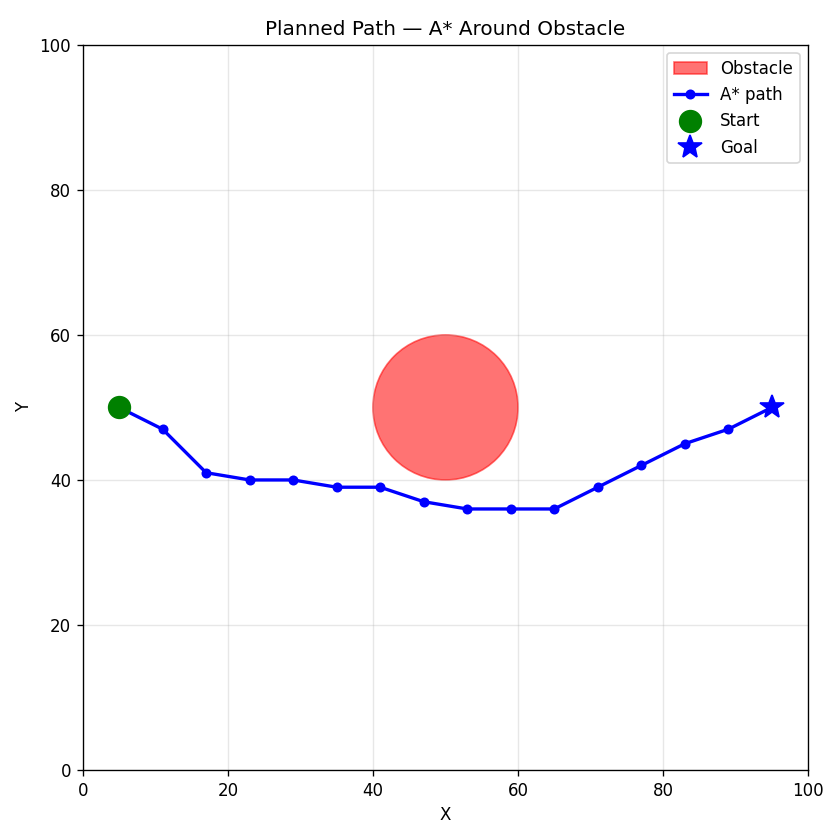
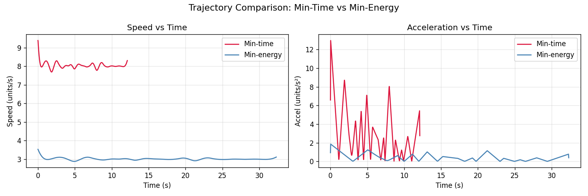

# Formation-Based UAV Path Planning

## Part 1 — What did I build?

5 drones fly in a **V-formation** from start to goal while avoiding a circular obstacle using the **A\*** path planning algorithm. Two smooth trajectories are generated and compared: minimum-time (fast, high energy) and minimum-energy (slow, gentle accelerations).

---

## Part 2 — Setup

```bash
git clone https://github.com/your-username/your-repo.git
cd your-repo/end_term
pip install -r requirements.txt
```

---

## Part 3 — How to run

```bash
python simulate.py
```

This will:
- Print a path/trajectory summary to the terminal
- Save `results/path_plot.png`
- Save `results/trajectory_comparison.png`
- Save `results/formation_animation.gif`
- Open the animation window (close it to finish)

---

## Part 4 — What each script does

| File | Role |
|---|---|
| `map_setup.py` | Defines the 100×100 grid, obstacle at (50,50) radius 10, start (5,50), goal (95,50) |
| `path_planner.py` | A* on a grid graph (8-connected) to find a collision-free waypoint path |
| `trajectory.py` | Converts waypoints into smooth cubic-spline trajectories at two speed profiles |
| `formation.py` | Defines V-shape offsets for 5 drones and computes per-drone positions from centroid |
| `simulate.py` | Runs everything end-to-end, produces all plots and the animated GIF |

---

## Part 5 — Results

### Planned Path



### Trajectory Comparison



**Observations:**
- Min-time finishes in **~12.1 seconds** at a constant high speed of 8 units/s
- Min-energy takes **~32.3 seconds** at a gentler speed of 3 units/s
- Min-energy uses **~94.7% less energy** (measured as integrated squared acceleration)
- The speed profile for min-time is flat and high; min-energy is flat and low — neither changes much because both use constant-speed splines, but the acceleration at curve bends is much larger for min-time

---

## Part 6 — Formation details

- **Shape:** V-formation (like a bird flock)
- **Number of drones:** 5
- **Offsets from centroid:**

```
Drone 1: (-4, +4)   ← left tip
Drone 2: (-2, +2)   ← left mid
Drone 3: ( 0,  0)   ← centre (lead)
Drone 4: (+2, +2)   ← right mid
Drone 5: (+4, +4)   ← right tip
```

Each drone's position is computed as: `centroid + rotate(offset, heading_angle)`. The offsets stay fixed so the V shape is always aligned with the direction of travel.
