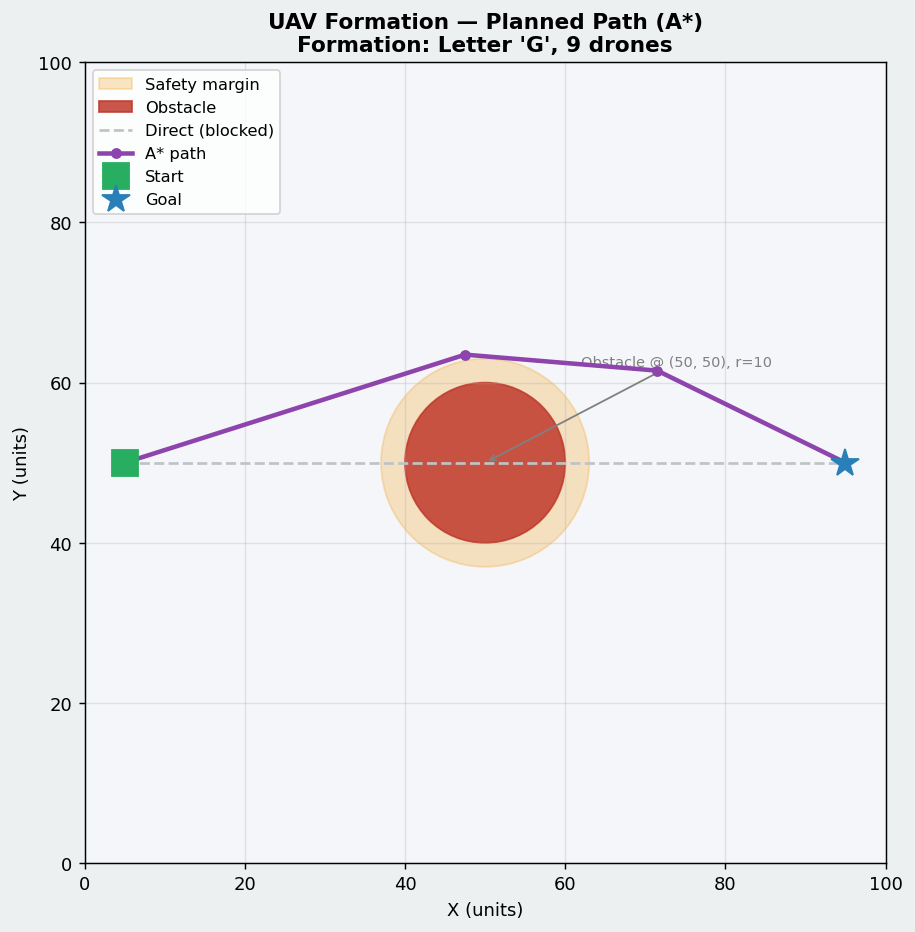
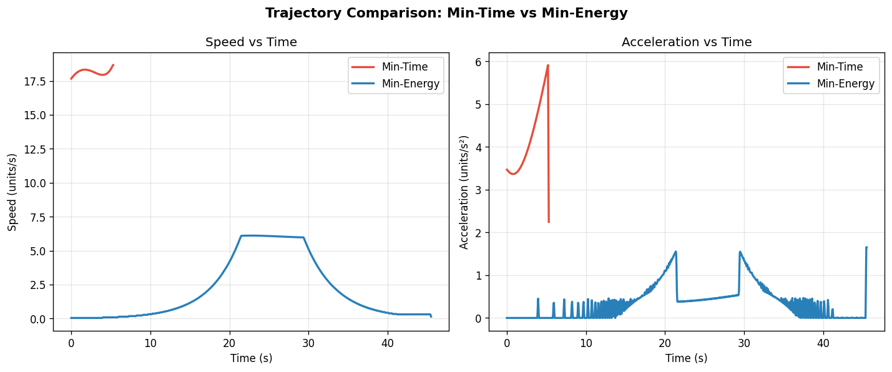
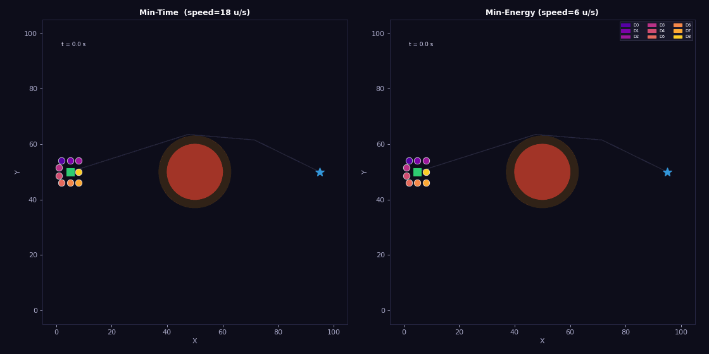

# Formation-Based UAV Path Planning in Simulation

## Part 1 — What I built?

This task simulates **9 UAVs flying in a letter 'G' formation** from a start point `(5, 50)` to a goal point `(95, 50)` on a 100×100 2D grid, with a circular obstacle at `(50, 50)` blocking the direct path.  The formation centroid path is found using the **A\* algorithm** (8-connected grid, Euclidean heuristic, greedy waypoint pruning), and two smooth trajectories are generated — **minimum-time** (high constant speed) and **minimum-energy** (trapezoidal velocity profile) — using cubic-spline interpolation.  All 9 drones maintain fixed offsets from the centroid throughout the flight, producing a rigid 'G' formation that navigates cleanly around the obstacle.

---

## Part 2 — Setup

```bash
git clone https://github.com/your-username/your-repo.git
cd your-repo/end_term
pip install -r requirements.txt
```

> **Python version:** 3.9 or higher recommended.

---

## Part 3 — How to run

```bash
python simulate.py
```

What happens when you run it:

1. A* computes a collision-free path around the obstacle and **saves** `results/path_plot.png`.
2. Two smooth trajectories (min-time & min-energy) are generated and **saved** as `results/trajectory_comparison.png`.
3. A side-by-side animation of both trajectories is rendered and **saved** as `results/formation_animation.gif`.
4. A summary table is **printed** to the terminal showing total time, max speed, and energy proxy for each trajectory.

No interactive window is opened — everything is saved directly to the `results/` folder.

---

## Part 4 — What each script does

| File | Role |
|------|------|
| `map_setup.py` | Defines the 100×100 2D grid, places the circular obstacle at (50,50) with radius 10, sets start (5,50) and goal (95,50), and builds the boolean obstacle grid used by the planner. |
| `path_planner.py` | Implements **A\*** on the obstacle grid (8-connected, Euclidean heuristic) followed by greedy line-of-sight waypoint pruning to produce a compact collision-free waypoint list. |
| `trajectory.py` | Fits a cubic spline through the waypoints and samples two time-stamped (x, y, t) trajectories: a constant-speed **min-time** version and a trapezoidal **min-energy** version with gentle ramp-up/ramp-down. |
| `formation.py` | Defines the 9-point letter-'G' formation as fixed (dx, dy) offsets from the centroid, and provides `expand_to_drones()` to produce per-drone trajectories. |
| `simulate.py` | Orchestrates all modules: plans the path, generates trajectories, expands to drone positions, saves all output plots, renders and saves the animation, then prints the summary metrics. |

---

## Part 5 — Results

### Path Plot



### Trajectory Comparison



### Formation Animation



### Observations

| Metric | Min-Time | Min-Energy |
|--------|----------|------------|
| Total duration | 5.30 s | 45.50 s |
| Max speed | 18.66 units/s | 6.11 units/s |
| Energy proxy (∫a² dt) | 95.71 | 11.69 |

- **Min-Time** is approximately **8.6× faster** than Min-Energy because it travels at constant peak speed with no ramping.
- **Min-Energy** uses roughly **88 % less energy** (measured as ∫a² dt, a standard proxy for propulsion effort) because the trapezoidal velocity profile eliminates sharp acceleration transients.
- The acceleration-vs-time plot shows that Min-Time has a flat spike at the start and end (step change in speed), while Min-Energy shows smooth, gradual ramps — exactly the intended behaviour.
- **Path distance** covers 94.84 units with just **4 pruned waypoints**, demonstrating the effectiveness of the greedy line-of-sight pruning on top of A*.

---

## Part 6 — Formation details

- **Formation shape:** Letter **'G'**
- **Number of UAVs:** **9**
- **Drone-to-position assignment:** Each drone is permanently assigned a fixed (dx, dy) offset from the formation centroid.  The offsets are hard-coded in `formation.py` and never change during flight.

| Drone | dx | dy | Role in 'G' |
|-------|----|----|-------------|
| D0 | −3 | +4 | Top bar left |
| D1 |  0 | +4 | Top bar centre |
| D2 | +3 | +4 | Top bar right |
| D3 | −4 | +1.5 | Left stem upper |
| D4 | −4 | −1.5 | Left stem lower |
| D5 | −3 | −4 | Bottom bar left |
| D6 |  0 | −4 | Bottom bar centre |
| D7 | +3 | −4 | Bottom bar right |
| D8 | +3 |  0 | Inner crossbar (right) |

The centroid follows the A\*-planned path; each drone's world position is simply `centroid + offset`, so the rigid 'G' shape is always preserved regardless of the trajectory type.

---

## File structure

```
end_term/
├── README.md
├── requirements.txt
├── map_setup.py
├── path_planner.py
├── trajectory.py
├── formation.py
├── simulate.py
└── results/
    ├── path_plot.png
    ├── trajectory_comparison.png
    └── formation_animation.gif
```