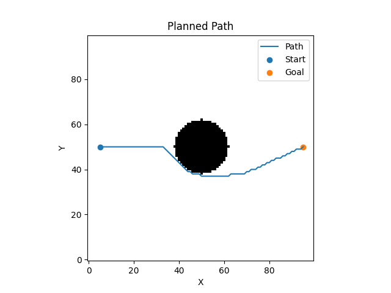
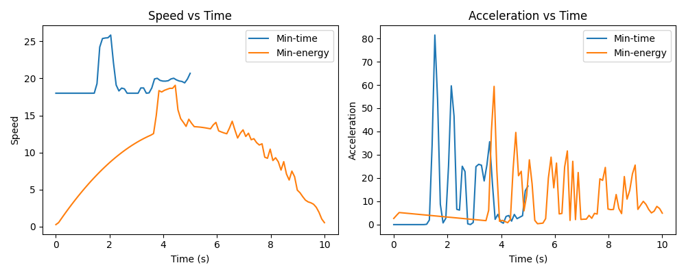

# Formation-Based UAV Path Planning Simulation

## 1. What did I build?
This project simulates multiple UAVs flying from a start point to a goal point while maintaining a fixed formation shape.
I implemented the **A*** path planning algorithm to generate a collision-free path around an obstacle.
The formation used is a **V-shape** with **5 UAVs**, and two trajectories are compared: **minimum-time** and **minimum-energy**.

## 2. Setup
git clone https://github.com/your-username/your-repo.git
cd your-repo/end_term
pip install -r requirements.txt

## 3. How to Run
python simulate.py
mkdir -p .mplconfig && MPLCONFIGDIR="$(pwd)/.mplconfig" MPLBACKEND=Agg python3 simulate.py

This will:
* Generate the planned path
* Create two trajectories (minimum-time and minimum-energy)
* Animate UAVs flying in formation
* Save plots and animation in the `results/` folder

## 4. File Description
* `map_setup.py` — Defines the 2D grid map, obstacle, start and goal points
* `path_planner.py` — Implements A* algorithm to compute a collision-free path
* `trajectory.py` — Generates smooth minimum-time and minimum-energy trajectories
* `formation.py` — Defines UAV formation shape and position offsets
* `simulate.py` — Runs the simulation, animation, and saves results

## 5. Results

### Path Planning

### Trajectory Comparison

### Observation
* The **minimum-time trajectory** completes in **5.00s** covering a distance of **97.74 units** with an energy cost of **23487.90**.
* The **minimum-energy trajectory** completes in **10.00s** covering a distance of **99.27 units** with an energy cost of **19875.22**.
* The min-time trajectory is **2x faster** but consumes **~18% more energy** than the min-energy trajectory.

## 6. Formation Details
* Formation Shape: **V-shape**
* Number of UAVs: **5**
* Method: Each UAV maintains a fixed offset from the centroid, ensuring the formation remains constant during motion.