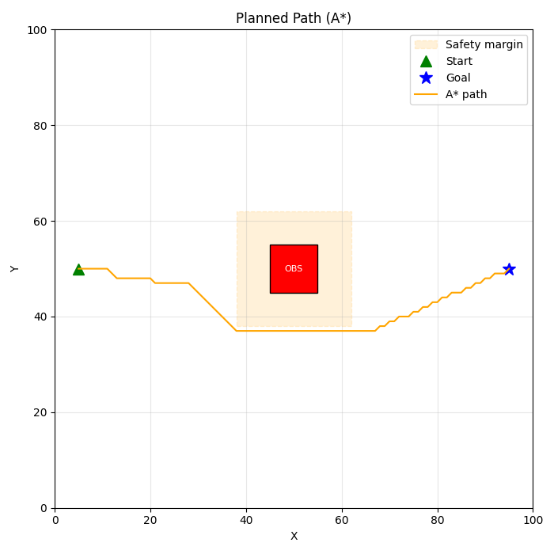
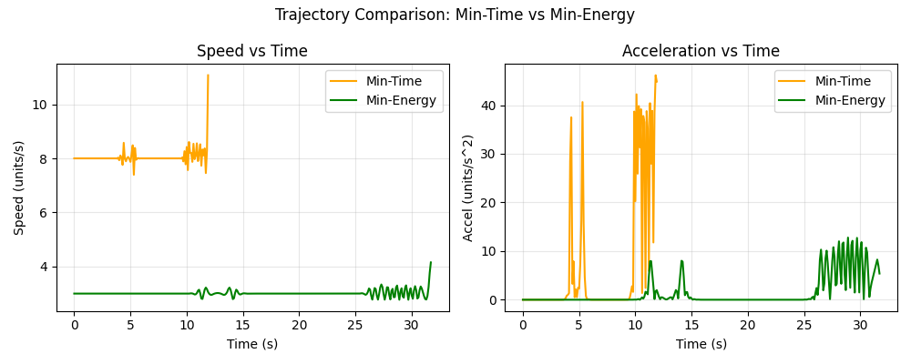

# End-Term Project: Formation-Based UAV Path Planning
## Part 1 — What did I build?

I built a Python simulation of 5 UAVs flying together in a V-formation from a start point at (5, 50) to a goal point at (95, 50) on a 100x100 grid. There is a single rectangular obstacle (10x10 units) placed at the centre of the map that blocks the straight-line path between start and goal. I used the A* algorithm to find a path around it.

Once the path was found, I generated two versions of the trajectory — one that tries to reach the goal as fast as possible (min-time) and one that moves slowly and smoothly to save energy (min-energy). All 5 drones fly together maintaining the V-shape throughout the entire flight, from start to goal.

---
## Part 2 — Setup

```bash
git clone https://github.com/<your-username>/Winter-projects-25-26.git
cd Winter-projects-25-26/Formation-Based\ UAV\ Path\ Planning/End-Eval/ArshChauhan_240196
pip install -r requirements.txt
```

The only dependencies are numpy, matplotlib, and scipy.
---

## Part 3 — How to run

```bash
python simulate.py
```

When you run this, the script goes through 5 steps automatically and prints progress to the terminal. It plans the path, generates both trajectories, and saves all plots and animations to the results/ folder. No window will pop up — everything is saved directly to disk. At the end it prints a short summary of total time, distance, and energy saved.

---

## Part 4 — What each script does

- map_setup.py — defines the 100x100 grid, places the 10x10 rectangular obstacle at the centre, sets the start and goal coordinates, and defines a safety margin so the path planner keeps the centroid far enough from the obstacle for all drones to clear it
- path_planner.py — implements A* on the grid using 8-directional movement; the obstacle cells are expanded by the safety margin before planning so the whole formation stays clear
- trajectory.py — takes the waypoints from A* and fits a cubic spline through them, then samples it at two different speeds to produce the min-time and min-energy trajectories
- formation.py — defines the V-shape with 5 drones as fixed offsets from the centroid, and rotates those offsets by the heading angle at each step so the V always points in the direction of travel
- simulate.py — the main script that runs everything in order and saves all results to the results/ folder

---

## Part 5 — Results

### Planned Path (A*)



The A* algorithm found a path of 91 waypoints with a total distance of 100.8 units. The path curves below the obstacle. The dashed region in the plot is the safety margin — the centroid path stays outside this so that even the outermost drones never touch the actual obstacle.

### Trajectory Comparison



**Observations:**

- The min-time trajectory completes the journey in 12.6 seconds at 8 units/s. Speed rises quickly, stays high, then drops at the end. Acceleration is high throughout.
- The min-energy trajectory takes 33.6 seconds — about 2.7x longer — at only 3 units/s with much gentler speed changes and noticeably lower acceleration.
- The min-energy trajectory uses approximately 85% less energy, measured as the integral of acceleration squared over time.
- In a real mission you would pick min-time when speed matters and min-energy when battery life matters more.

---

## Part 6 — Formation details

**Shape:** V-formation

**Number of drones:** 5

**Drone offsets from centroid:**

| Drone | Role             |  dx  |  dy  |
|-------|------------------|------|------|
| D0    | Centre lead      |  0.0 |  0.0 |
| D1    | Right inner wing | -2.0 | -2.0 |
| D2    | Right outer wing | -4.0 | -4.0 |
| D3    | Left inner wing  | -2.0 |  2.0 |
| D4    | Left outer wing  | -4.0 |  4.0 |

Each drone's position at every time step is the centroid position plus its fixed offset, rotated by the current heading angle. The rotation makes the V point forward in the direction of travel. Because the outer drones sit up to 5.7 units from the centroid, the path planner uses a safety margin of 7 units around the obstacle to guarantee no drone ever enters the obstacle region.
