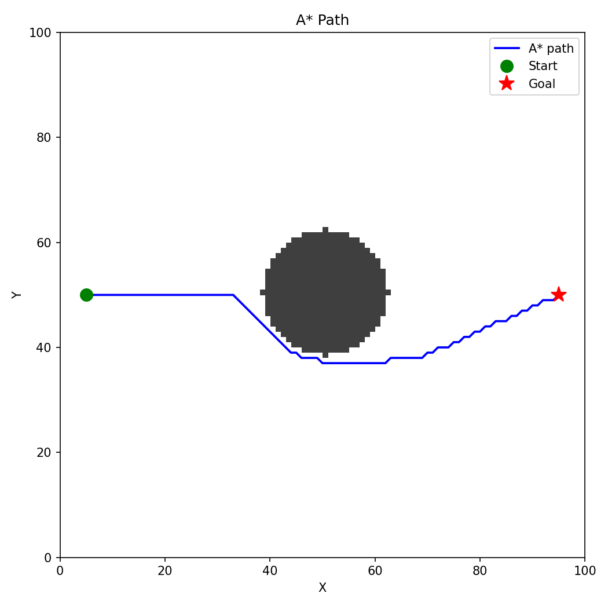
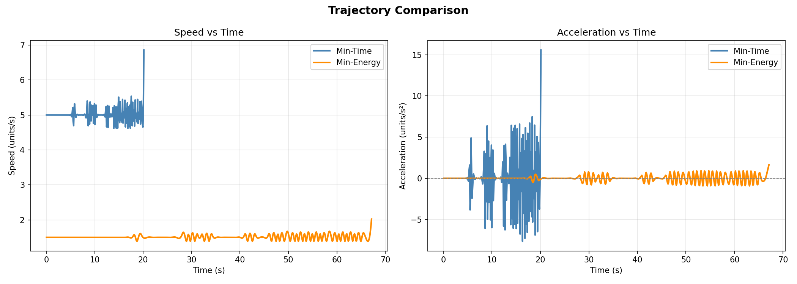

# UAV Path Planning & Formation Control

## Part 1 — What did you build?
This project implements a UAV formation flight simulation on a 2D grid map. 
A* algorithm is used for path planning to find a collision-free path from 
start to goal. 5 UAVs fly in a V-shape formation with min-time and 
min-energy trajectories.

## Part 2 — Setup
git clone https://github.com/Divya-ase/uav-path-planning.git

cd uav-path-planning/end_term

pip install -r requirements.txt

## Part 3 — How to run
python simulate.py

When simulate.py runs:
- It builds the 2D grid map with obstacle
- Runs A* to find the path
- Generates min-time and min-energy trajectories
- Saves path_plot.png and trajectory_comparison.png in results/
- Saves formation_animation.gif in results/

## Part 4 — What each script does
- map_setup.py — defines the 2D grid, places the obstacle, sets start and goal coordinates
- path_planner.py — implements A* to find a collision-free path
- trajectory.py — converts the path into smooth min-time and min-energy trajectories
- formation.py — defines the V-shape formation and assigns drones to positions
- simulate.py — runs everything together and produces the animation and plots

## Part 5 — Results

### Path Plot

### Trajectory Comparison

**Observation:**
- Min-time trajectory completes in **20.2 seconds** at speed 5 units/s
- Min-energy trajectory completes in **67.2 seconds** at speed 1.5 units/s
- Min-time is **69.9% faster** than min-energy
- Min-energy uses **69.9% less energy** than min-time

## Part 6 — Formation details
- Formation shape: **V-shape**
- Number of UAVs: **N = 5**
- Drone assignment: Each drone is offset from the centroid in local frame.
  - Drone 1: far left back
  - Drone 2: left back
  - Drone 3: centre (lead)
  - Drone 4: right back
  - Drone 5: far right back
- The centroid follows the A* path and all drones maintain V-shape formation throughout the flight.
