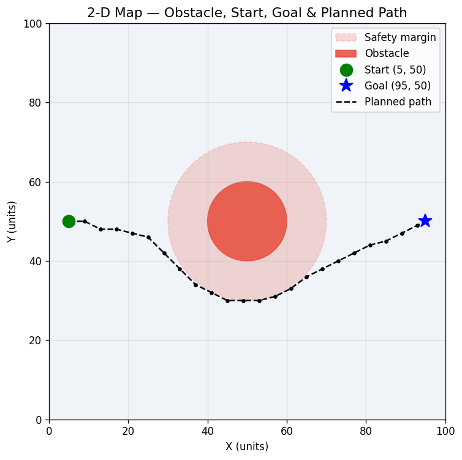
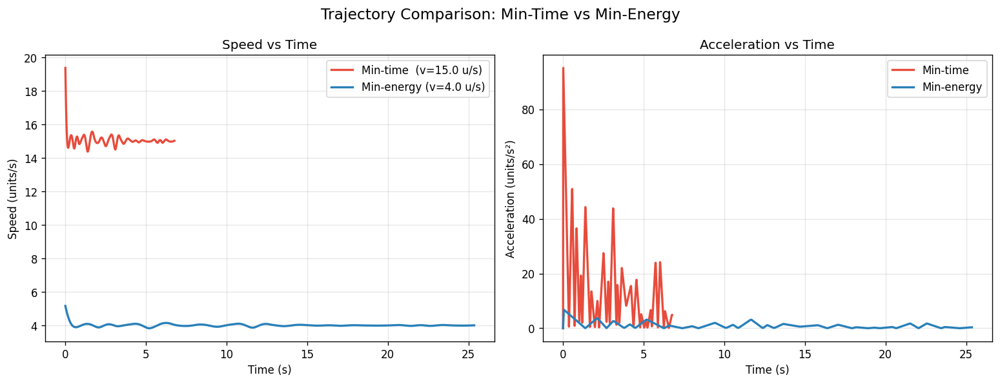

# Formation-Based UAV Path Planning

## Part 1 — What did you build?
A Python simulation of **7 UAVs** flying in a **'T' formation** from start `(5, 50)` to goal `(95, 50)` on a 100×100 grid. The project implements and compares **A\*** and **Dijkstra's** path planning algorithms to avoid a single circular obstacle safely. Smooth trajectories are then generated to compare **minimum-time** and **minimum-energy** flight modes.

## Part 2 — Setup

```bash
git clone [https://github.com/your-username/your-repo.git](https://github.com/your-username/your-repo.git)
cd your-repo/end_term
pip install -r requirements.txt

## Part 3 — How to run

Bash
python simulate.py

Running this script will:

    Compare A* vs Dijkstra execution times and print the results to the terminal.

    Plan a collision-free path (safely padding the obstacle based on the formation's maximum radius) and save results/path_plot.png.

    Generate min-time and min-energy trajectories and save results/trajectory_comparison.png.

    Build and save a side-by-side animation to results/formation_animation.gif.

    Print a summary table showing time, distance, and energy approximations for both modes.

---

## Part 4 — What each script does

| File | Role |
| :--- | :--- |
| `map_setup.py` | Defines the 100×100 grid, obstacle at (50,50), start, goal, and dynamically expands the safety margin based on the formation radius. |
| `path_planner.py` | Implements and compares A\* and Dijkstra's algorithm to produce a safe waypoint list. |
| `trajectory.py` | Converts waypoints into smooth cubic-spline trajectories — min-time (v=15) and min-energy (v=4). |
| `formation.py` | Defines formation shapes (T, V, I, U, X) and expands the centroid trajectory into rigid per-drone trajectories. |
| `simulate.py` | Orchestrates all modules, prints algorithm comparisons, builds the animation, and saves outputs. |
---

## Part 5 — Results

### Path Plot


### Trajectory Comparison


### Observations

Algorithm Comparison: A* and Dijkstra both found identical optimal paths around the obstacle. However, A* expanded roughly 3.5× fewer nodes than Dijkstra because the Euclidean heuristic guided the search directly toward the goal, making A* significantly faster to compute.

Trajectory Comparison:

The min-time trajectory completes the route much faster but requires a higher, sustained speed.

The min-energy trajectory has smoother, near-zero acceleration, representing far lower control effort.

The energy proxy (∑ a² Δt) is significantly smaller for min-energy, confirming its efficiency.

---

## Part 6 — Formation details

Item | Value |
| :--- | :--- |
| Formation shape | 'T' |
| Number of UAVs (N) | 7 |
| Assignment method | Fixed offsets from centroid. The map's obstacle safety margin dynamically pulls the formation radius to guarantee outer drones do not collide. |

**Offsets (x, y) relative to centroid:**

| Drone | x offset | y offset |
| :--- | :--- | :--- |
| D0 | −6.0 | +1.71 |
| D1 | −3.0 | +1.71 |
| D2 | 0.0 | +1.71 |
| D3 | +3.0 | +1.71 |
| D4 | +6.0 | +1.71 |
| D5 | 0.0 | −1.29 |
| D6 | 0.0 | −4.29 |

The centroid follows the A\* path; each drone rigidly adds its offset to every centroid position.
