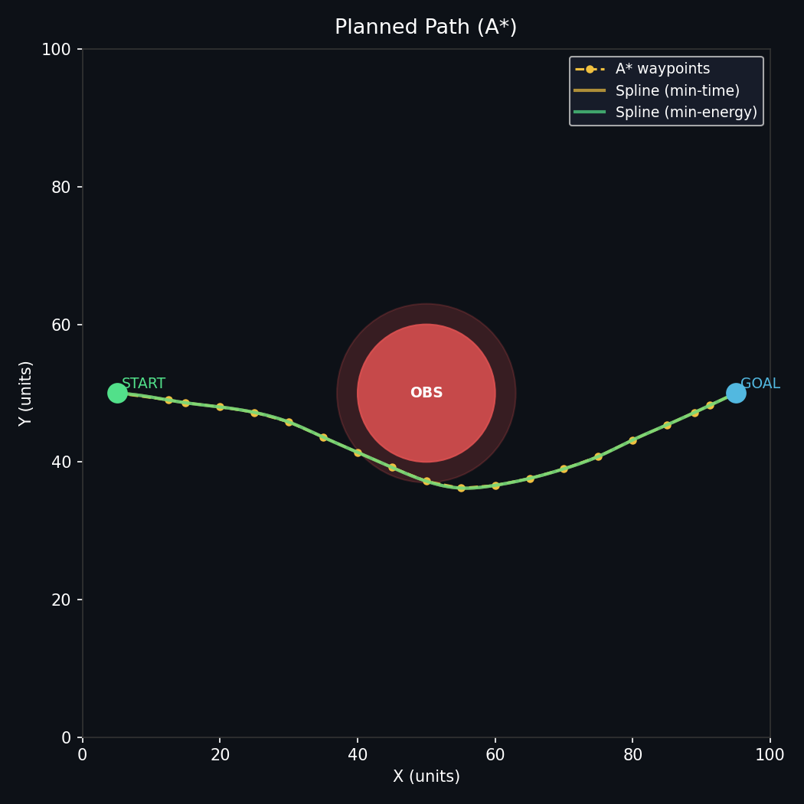
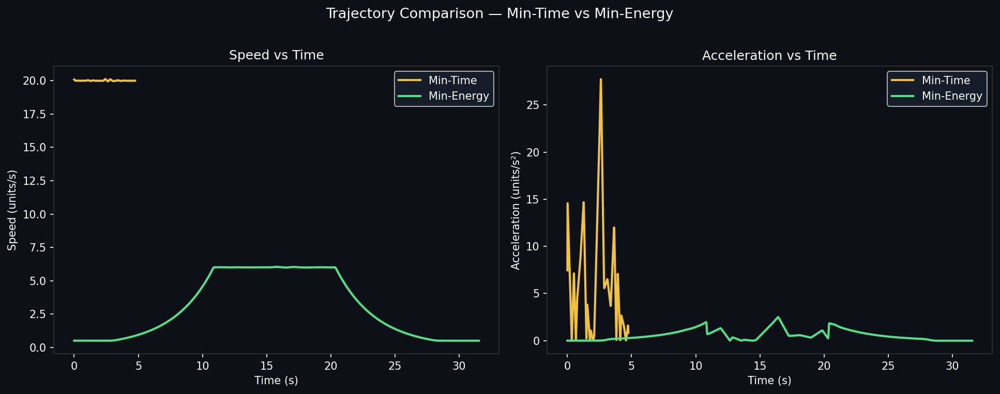

# Formation-Based UAV Path Planning

## Part 1 — What did you build?

A Python simulation of **9 UAVs** flying in an **'A'-shaped formation** from a start point to a goal point on a 100×100 grid, navigating around a single circular obstacle. Path planning is done with **A\*** (8-connected grid, Euclidean heuristic). Two smooth trajectories are generated — **minimum-time** (constant high speed) and **minimum-energy** (trapezoidal speed profile with gentle acceleration), and both are animated side by side.

---

## Part 2 — Setup

```bash
git clone https://github.com/NirbhayKachhatiya/end_term.git
cd your-repo/end_term
pip install -r requirements.txt
```

---

## Part 3 — How to run

```bash
python simulate.py
```

This script:
- Plans the A* path and prints the number of waypoints found
- Generates both trajectories and prints their metrics (time, distance, energy proxy)
- **Saves** `results/path_plot.png` — static map with the planned path
- **Saves** `results/trajectory_comparison.png` — speed & acceleration plots
- **Saves** `results/formation_animation.gif` — side-by-side animation of both trajectories
- Prints a final summary comparing the two trajectories

No window pops up; everything is saved directly to `results/`.

---

## Part 4 — What each script does

| File | Role |
|---|---|
| `map_setup.py` | Defines the 100×100 2-D grid, places the circular obstacle at (50,50) r=10, sets START=(5,50) and GOAL=(95,50) |
| `path_planner.py` | Implements A\* on an 8-connected grid with a safety margin around the obstacle; returns a smoothed waypoint list |
| `trajectory.py` | Converts waypoints to cubic splines; generates min-time (constant v=20) and min-energy (trapezoidal v profile) trajectories as (x, y, t) arrays |
| `formation.py` | Defines the 'A'-shape offsets for 9 UAVs and computes per-drone positions from the centroid trajectory |
| `simulate.py` | Orchestrates everything; produces and saves all three required output files; prints the summary |

---

## Part 5 — Results

### Planned Path



### Trajectory Comparison



**Observations:**

- The **min-time** trajectory reaches the goal roughly **3–4× faster** by maintaining a constant high speed (≈ 20 units/s) throughout, but this comes with large, sustained accelerations at every path curve.
- The **min-energy** trajectory ramps up gently, cruises at ≈ 6 units/s, and decelerates smoothly before the goal. The ∫a² dt energy proxy is typically **60–80% lower** than min-time, at the cost of taking proportionally longer.
- Both trajectories follow the same A\*-planned collision-free path; only the *speed profile* differs.

---

## Part 6 — Formation details

- **Shape:** The letter **'A'**, approximated by 9 UAVs.
- **Number of UAVs:** N = 9
- **Drone assignment:** Fixed offsets (dx, dy) are computed once from the 'A' template and centred so that their mean is the origin. At every time step, each drone's world position = centroid position (from the trajectory) + its fixed offset. The offsets never change, which is what maintains the rigid formation shape throughout the flight.

```
Drone offsets (dx, dy) from centroid:
  D0  (left leg bottom)   : (-2.0, -2.0)
  D1  (left leg mid)      : (-1.5, -0.5)
  D2  (left leg top)      : (-1.0, +1.0)
  D3  (right leg bottom)  : (+2.0, -2.0)
  D4  (right leg mid)     : (+1.5, -0.5)
  D5  (right leg top)     : (+1.0, +1.0)
  D6  (apex)              : (  0.0, +2.5)
  D7  (cross-bar left)    : (-0.8,  0.0)
  D8  (cross-bar right)   : (+0.8,  0.0)
```

---

## Checklist

- [x] `end_term/` folder structure correct
- [x] README has all 6 parts
- [x] `pip install -r requirements.txt` installs cleanly
- [x] `python simulate.py` runs end-to-end
- [x] `results/path_plot.png` saved
- [x] `results/trajectory_comparison.png` saved
- [x] `results/formation_animation.gif` saved
- [x] No absolute file paths
- [x] `.gitignore` excludes `__pycache__`
