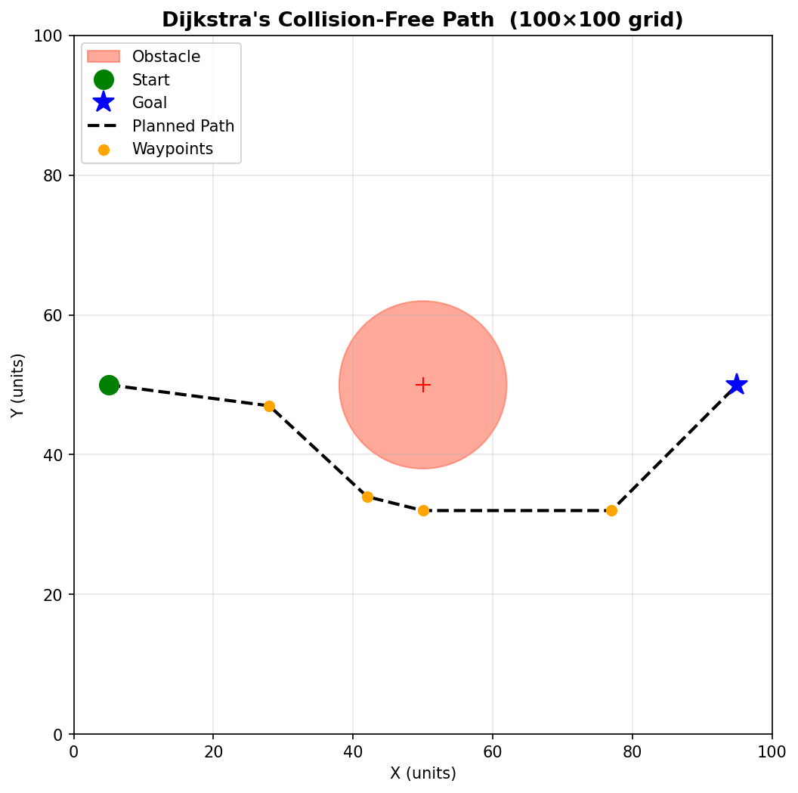
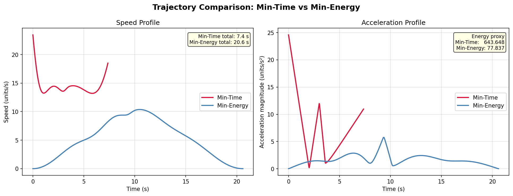

# Formation-Based UAV Path Planning — Letter 'R'

## Part 1 — What did you build?

This project simulates **10 UAVs flying in a rigid letter 'R' formation** from a start point to a goal point while navigating around a single circular obstacle on a 100 × 100 unit grid. Path planning uses **Dijkstra's algorithm** on an 8-connected grid. Two trajectory profiles are generated and compared: a **minimum-time** trajectory (constant high speed) and a **minimum-energy** trajectory (smooth raised-cosine velocity profile). The simulation is animated with both trajectories shown side-by-side.

---

## Part 2 — Setup

```bash
git clone https://github.com/electricalengineersiitk/Winter-projects-25-26/.git
cd Winter-projects-25-26/Formation-Based UAV Path Planning/Rajkumar_Ahirwar_240836-END_EVAL
pip install -r requirements.txt
```

**Dependencies** (all installable via pip):

- `numpy >= 1.24`
- `scipy >= 1.10`
- `matplotlib >= 3.7`
- `Pillow >= 9.0`

---

## Part 3 — How to run

```bash
python simulate.py
```

Running this script will:

1. Plan a collision-free path using Dijkstra's algorithm and print planning metrics.
2. Generate and compare both trajectory profiles (metrics printed to console).
3. Save `results/path_plot.png` — the planned path on the 2D map.
4. Save `results/trajectory_comparison.png` — speed and acceleration profiles side-by-side.
5. Save `results/formation_animation.gif` — animated simulation of 10 drones flying in 'R' formation for both trajectories simultaneously.
6. Print a final summary table comparing duration and energy for both trajectories.

No display window is opened — all outputs go directly to `results/`.

---

## Part 4 — What each script does

| File                | Role                                                                                                                                                                                                                                                                              |
| ------------------- | --------------------------------------------------------------------------------------------------------------------------------------------------------------------------------------------------------------------------------------------------------------------------------- |
| `map_setup.py`    | Defines the 100×100 2D grid, places the circular obstacle at (50,50) r=12, sets start (5,50) and goal (95,50). Provides `get_obstacle_mask()` and `plot_map()` used by all other scripts.                                                                                    |
| `path_planner.py` | Implements Dijkstra's shortest-path algorithm on an 8-connected grid with a 5-cell safety inflation around the obstacle. Returns a list of (x,y) waypoints. Includes Ramer-Douglas-Peucker path simplification.                                                                   |
| `trajectory.py`   | Fits a `CubicSpline` along arc-length to smooth waypoints. Generates min-time trajectory (constant 14 units/s) and min-energy trajectory (raised-cosine speed profile peaking at 10 units/s, mean 5 units/s). Returns time-stamped position, velocity, and acceleration arrays. |
| `formation.py`    | Defines the 10-drone letter 'R' formation as fixed (dx,dy) offsets from the centroid. Provides `get_drone_positions(centroid_xy)` so every script can place all drones given any centroid position.                                                                             |
| `simulate.py`     | Master script. Imports all modules, orchestrates the 5-step pipeline, renders both trajectories in a side-by-side Matplotlib animation, and saves all required plots and the GIF to `results/`.                                                                                 |

---

## Part 5 — Results

### Path Plot



Dijkstra's algorithm finds a clean detour around the obstacle, navigating either above or below (it chose above). The simplified path has 6 waypoints.

### Trajectory Comparison



| Metric                                | Min-Time            | Min-Energy                      |
| ------------------------------------- | ------------------- | ------------------------------- |
| **Total duration**              | **7.36 s**    | 20.60 s                         |
| **Energy proxy** (∫\|a\|² dt) | 643.65              | **77.84**                 |
| Speed profile                         | Constant 14 units/s | Raised-cosine, 0→10→0 units/s |

**Observations:**

- The **min-time** trajectory is **64.3% faster** — it reaches the goal in 7.4 s vs 20.6 s.
- The **min-energy** trajectory uses **87.9% less energy** — the smooth cosine velocity profile eliminates sharp acceleration spikes, dramatically reducing the integral of squared acceleration.
- The acceleration plot shows the stark contrast: min-time has high constant acceleration from path curvature while min-energy has a gentle bell-shaped profile with near-zero acceleration at start and end.

---

## Part 6 — Formation details

**Shape:** Letter `'R'`
**Number of UAVs:** `N = 10`
**Scale factor:** 4× (formation spans ≈ 16 × 8 units)

The 10 drones are assigned to the following skeleton points of the letter R:

```
Drone  0 → bottom of vertical stroke
Drone  1 → lower vertical
Drone  2 → mid vertical (bowl junction)
Drone  3 → upper vertical
Drone  4 → top-left corner
Drone  5 → top-right of bowl (horizontal bar)
Drone  6 → upper-right bowl curve
Drone  7 → lower-right bowl curve
Drone  8 → bowl-closes-back point (meets vertical at mid)
Drone  9 → diagonal leg tip (bottom-right)
```

**Formation offsets** (dx, dy) from centroid (in simulation units):

| Drone | dx    | dy    |
| ----- | ----- | ----- |
| D0    | -3.20 | -9.20 |
| D1    | -3.20 | -5.20 |
| D2    | -3.20 | -1.20 |
| D3    | -3.20 | +2.80 |
| D4    | -3.20 | +6.80 |
| D5    | +0.80 | +6.80 |
| D6    | +4.80 | +4.80 |
| D7    | +4.80 | +0.80 |
| D8    | +0.80 | -1.20 |
| D9    | +4.80 | -5.20 |

All offsets remain **constant throughout the flight** — only the centroid moves along the planned trajectory. This rigid-offset scheme guarantees the 'R' shape is maintained from takeoff to landing.
