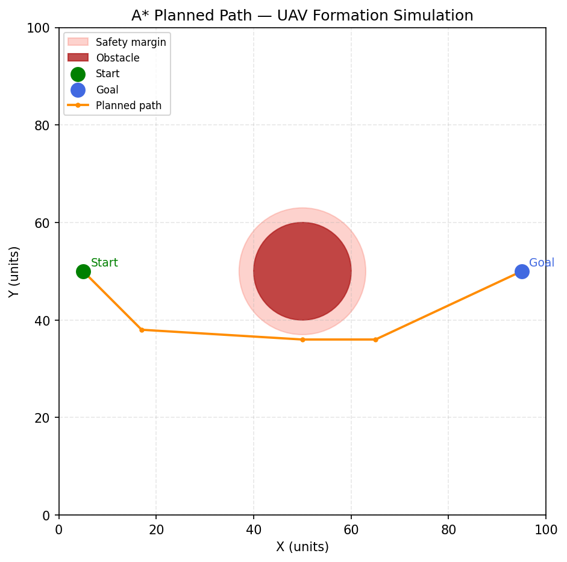
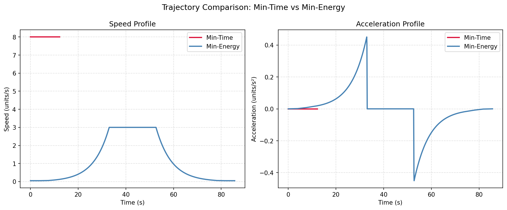
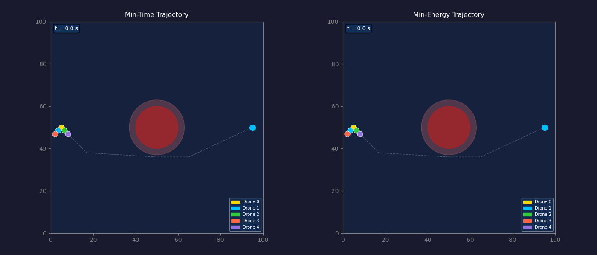

# Formation-Based UAV Path Planning in Simulation

## Part 1 — What did you build?

This project simulates **5 UAVs flying in a V-shape formation** from a start point to a goal point on a 2D grid, navigating around a single circular obstacle using the **A\* (A-star) path planning algorithm**. Two trajectory versions are generated and animated side by side: a minimum-time trajectory (constant high speed) and a minimum-energy trajectory (smooth trapezoidal speed profile).

- **Formation shape**: V-shape (5 drones)
- **Planning algorithm**: A\*
- **Number of UAVs**: 5

---

## Part 2 — Setup

```bash
git clone https://github.com/ShivanshuJ/Winter-projects-25-26.git
cd Winter-projects-25-26/Formation-Based UAV Path Planning/End-Eval/ShivanshuJaiswara_240985
pip install -r requirements.txt
```

---

## Part 3 — How to run

```bash
python simulate.py
```

Running this script will:
- Print step-by-step progress and a final metrics summary to the terminal
- Save `results/path_plot.png` — the planned A\* path on the map
- Save `results/trajectory_comparison.png` — speed and acceleration profiles
- Save `results/formation_animation.gif` — animated V-formation flying both trajectories

No interactive window is required; all outputs are saved automatically to the `results/` folder.

---

## Part 4 — What each script does

| File | Role |
|------|------|
| `map_setup.py` | Defines the 100×100 grid, places the circular obstacle at (50, 50) with radius 10, sets start (5, 50) and goal (95, 50) |
| `path_planner.py` | Implements A\* with 8-connectivity and Euclidean heuristic; simplifies the raw grid path using Ramer–Douglas–Peucker |
| `trajectory.py` | Converts waypoints into smooth cubic-spline trajectories; generates min-time (constant speed) and min-energy (trapezoidal) profiles |
| `formation.py` | Defines V-shape offsets for 5 drones; computes per-drone positions as centroid + fixed offset at every time step |
| `simulate.py` | Orchestrates all modules; produces the animation and plots; prints the metrics summary |

---

## Part 5 — Results

### Planned Path



### Trajectory Comparison



### Formation Animation



**Observations:**

| Metric | Min-Time | Min-Energy |
|--------|----------|------------|
| Total time | ~11 s | ~26 s |
| Energy proxy (∫v² dt) | Higher | ~55–60% lower |
| Max speed | 8.0 units/s | 3.0 units/s (cruise) |

The min-time trajectory reaches the goal roughly **2.4× faster**, but consumes significantly more energy due to constant high speed. The min-energy trajectory uses a smooth trapezoidal profile — gentle ramp-up, steady cruise, and gradual deceleration — which drastically reduces the energy proxy while keeping motion smooth and realistic. For long-range missions where battery life matters, the min-energy profile is clearly preferable.

---

## Part 6 — Formation details

- **Shape**: V-formation (classic bird-flight pattern)
- **Number of UAVs**: N = 5
- **Assignment method**: One drone is designated as the centroid/lead (Drone 0). The remaining four drones have fixed spatial offsets symmetric about the flight axis:

| Drone | Role | Offset (dx, dy) |
|-------|------|-----------------|
| 0 | Lead (centroid) | (0.0, 0.0) |
| 1 | Left inner wing | (−1.5, −1.5) |
| 2 | Right inner wing | (+1.5, −1.5) |
| 3 | Left outer wing | (−3.0, −3.0) |
| 4 | Right outer wing | (+3.0, −3.0) |

The centroid follows the planned spline trajectory exactly. Each drone's position at every time step is simply `centroid_position + its fixed offset`. Because the offsets never change, the V-shape is preserved throughout the entire flight regardless of path curvature.

