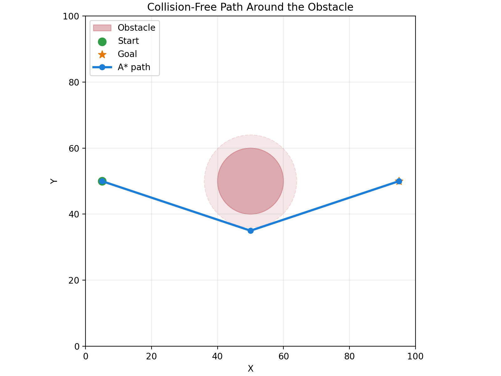
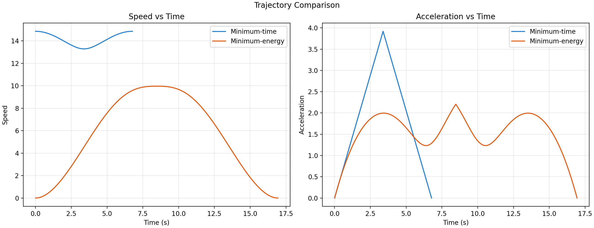

# End-Term UAV Formation Simulation

## Part 1 — What did you build?

This project simulates 7 UAVs flying from a start point to a goal point while holding a fixed letter A formation. I used A* path planning on a 2D grid with a single circular obstacle inflated by a safety margin, then generated two smoothed trajectories: minimum-time and minimum-energy.

## Part 2 — Setup

```bash
git clone https://github.com/itspriiyanshu/Winter-projects-25-26.git
cd UAVPathPlanning_240810_Priyanshu_Ranjan_EndEval/end_term
pip install -r requirements.txt
```

## Part 3 — How to run

```bash
python simulate.py
```

This runs the full pipeline, saves `results/path_plot.png`, `results/trajectory_comparison.png`, and `results/formation_animation.gif`, and prints a short metrics summary in the terminal.

## Part 4 — What each script does

- `map_setup.py` — defines the 2D grid, start and goal points, obstacle location, and safety margin.
- `path_planner.py` — implements A* to find a collision-free waypoint path around the obstacle.
- `trajectory.py` — converts the waypoint path into smooth minimum-time and minimum-energy trajectories.
- `formation.py` — defines the 7-UAV A formation and applies fixed offsets to maintain the shape.
- `simulate.py` — runs the full simulation, creates the plots, and saves the animation.

## Part 5 — Results





The minimum-time trajectory finishes first because it uses a higher cruising speed and a shorter time profile. The minimum-energy trajectory takes longer but uses less proxy energy because its speed and acceleration are smoother.

## Part 6 — Formation details

The chosen formation is the letter A with 7 UAVs. Drone assignments follow the order of the fixed offset list in `formation.py`, and the whole formation is rotated with the centroid heading so the shape stays intact throughout the flight.
