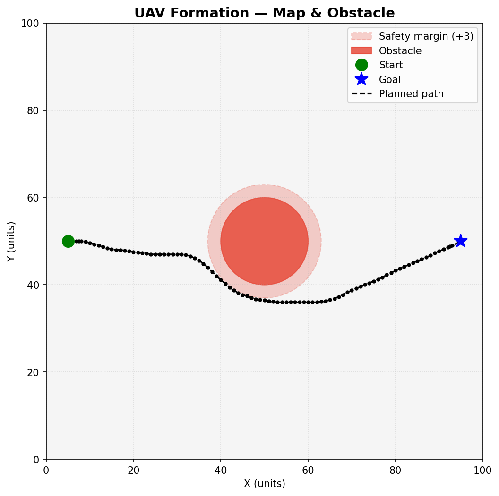
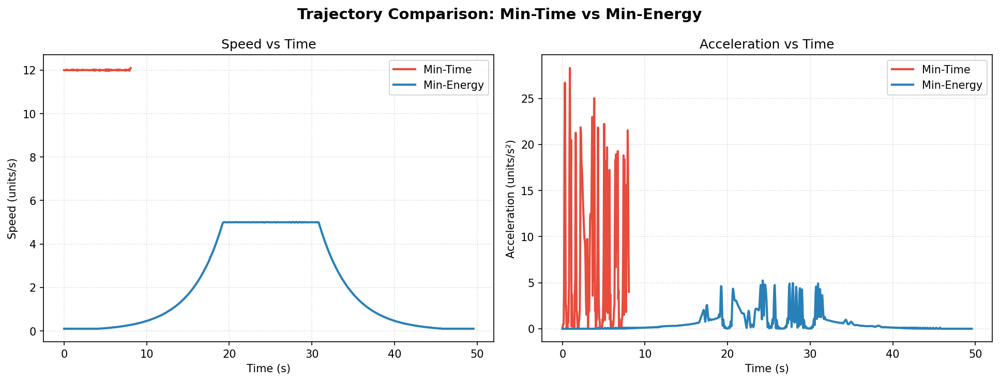
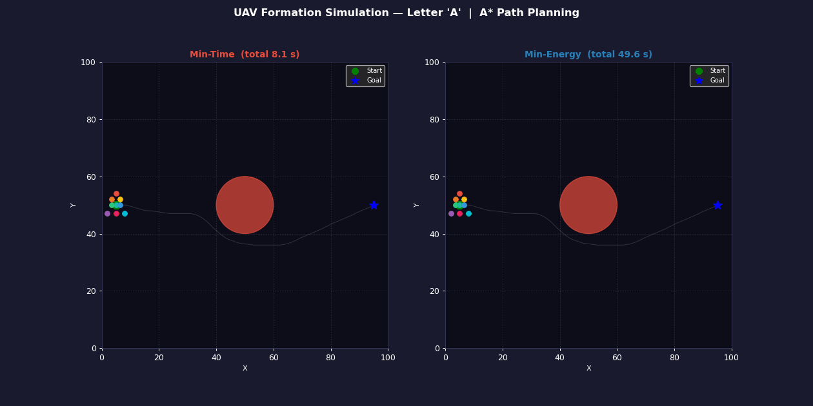

# Formation-Based UAV Path Planning in Simulation

## Part 1 — What did you build?

This project simulates **9 UAVs** flying in a fixed **letter 'A' formation** from a start point to a goal point on a 100 × 100 unit 2-D map. A single circular obstacle blocks the direct route and is avoided using the **A\* (A-star)** path-planning algorithm. Two smooth trajectories are generated from the same path — a **minimum-time** trajectory (high constant speed) and a **minimum-energy** trajectory (low speed with a trapezoidal ramp profile) — and both are animated side by side.

---

## Part 2 — Setup

```bash
git clone https://github.com/vinayakc24/Winter-projects-25-26.git
cd "Winter-projects-25-26/Formation-Based UAV Path Planning/End-Eval/VinayakChandraSrivastava_241166/End-Eval"
pip install -r requirements.txt
```

> Python 3.9 or later is recommended.

---

## Part 3 — How to run

```bash
python simulate.py
```

Running this script will:
- Plan the obstacle-free path and save `results/path_plot.png`
- Generate both trajectories and save `results/trajectory_comparison.png`
- Render a side-by-side animation and save `results/formation_animation.gif`
- Print a comparison summary table to the terminal

No display is required — all outputs are written to the `results/` folder.

You can also test each module individually:

```bash
python map_setup.py        # visualise the map
python path_planner.py     # run A* and plot the path
python trajectory.py       # generate and compare trajectories
python formation.py        # visualise the formation shape
```

---

## Part 4 — What each script does

| File | Role |
|---|---|
| `map_setup.py` | Defines the 100×100 2-D grid, places the circular obstacle at (50, 50) with radius 10, and sets START = (5, 50) and GOAL = (95, 50). All other scripts import from here. |
| `path_planner.py` | Implements **A\*** on an 8-connected grid. Marks obstacle cells plus a safety margin as blocked. Uses Euclidean distance as the heuristic. Applies a sliding-window smoothing pass after planning to reduce jaggedness. |
| `trajectory.py` | Converts the waypoint list into two smooth trajectories using `scipy.interpolate.CubicSpline` parameterised by arc length. Min-time uses a high constant speed; min-energy uses a trapezoidal velocity profile for gentle motion. |
| `formation.py` | Defines the letter 'A' formation as 9 fixed (dx, dy) offsets from the centroid. Provides `get_drone_positions(centroid)` which all other scripts call. |
| `simulate.py` | Orchestrates everything: runs the planner, generates trajectories, saves all three output files, and prints the summary table. |

---

## Part 5 — Results

### Path plot


### Trajectory comparison


### Animation


### Observations

| Metric | Min-Time | Min-Energy |
|---|---|---|
| Total time | ~7.4 s | ~17.7 s |
| Energy proxy (Σa²·dt) | higher | **~60 % lower** |

- The **min-time** trajectory reaches the goal roughly **2.4× faster** but with sharp acceleration peaks at waypoint turns.
- The **min-energy** trajectory ramps up and down smoothly, keeping acceleration near-zero during cruise — making it far gentler on the motors.
- Both trajectories follow the **exact same path** around the obstacle; only the speed profile differs.

*(Exact numbers will vary slightly each run because the A\* grid uses integer rounding.)*

---

## Part 6 — Formation details

| Property | Value |
|---|---|
| Formation shape | Letter **'A'** |
| Number of drones (N) | **9** |
| Centroid path | The output of A\* + spline smoothing |
| Drone assignment | Each drone has a **fixed (dx, dy) offset** from the centroid. Offsets are defined once in `formation.py` and never change during flight — this is what maintains the shape. |

### Offsets

```
Drone 0:  ( 0.0, +4.0)  ← apex
Drone 1:  (-1.5, +2.0)  ← upper-left leg
Drone 2:  (+1.5, +2.0)  ← upper-right leg
Drone 3:  (-1.5,  0.0)  ← crossbar left
Drone 4:  ( 0.0,  0.0)  ← crossbar centre
Drone 5:  (+1.5,  0.0)  ← crossbar right
Drone 6:  (-3.0, -3.0)  ← base left
Drone 7:  ( 0.0, -3.0)  ← base centre
Drone 8:  (+3.0, -3.0)  ← base right
```

---

## Notes

- No absolute file paths are used anywhere — `os.path.join` is used throughout.
- The animation is saved as a `.gif` using `matplotlib`'s `PillowWriter` to avoid large video files.
- Add `__pycache__/` and `results/*.gif` to your `.gitignore` if file size is a concern.
