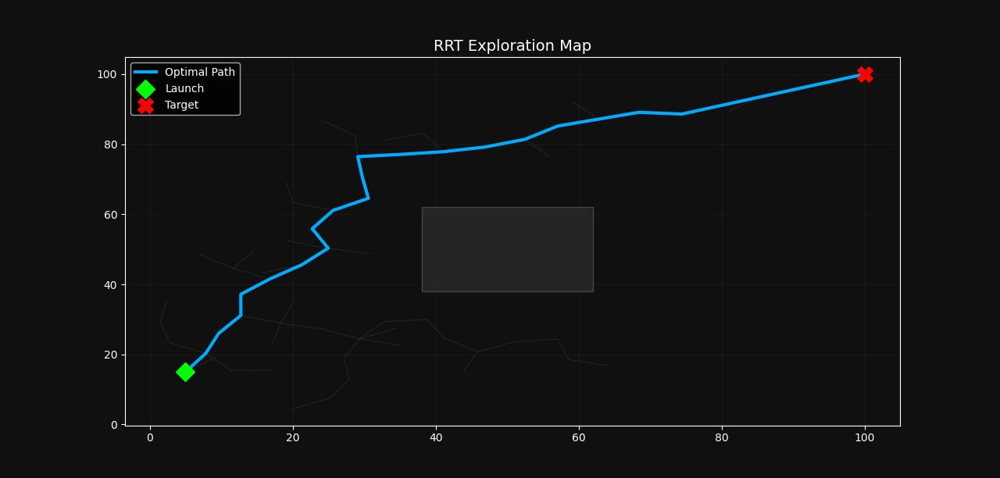
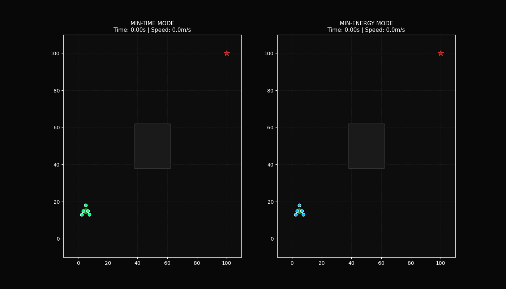
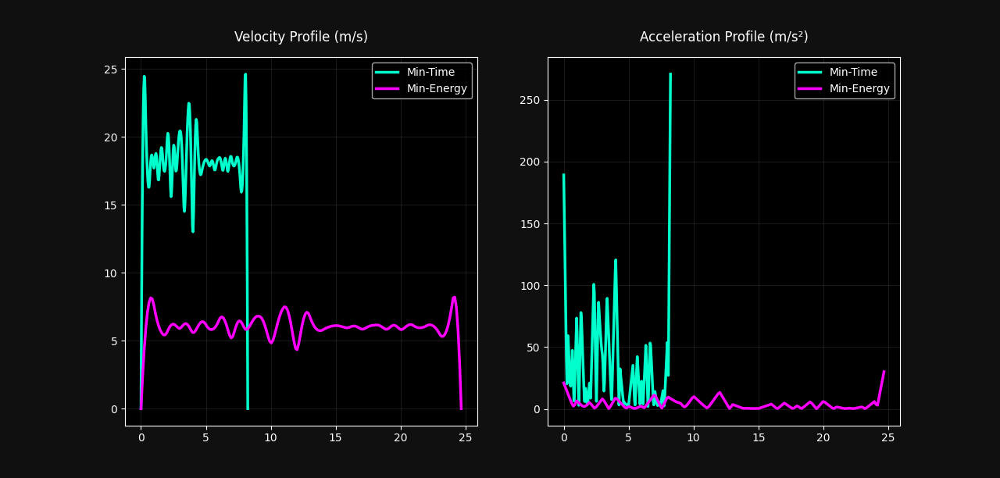

# UAV Formation Flight Simulation - End-Term Project

## Part 1 — What did you build?
I built a simulation where 5 UAVs fly in a fixed 'A' formation shape from a starting point to a target goal. The project uses the RRT path planning algorithm to navigate around a square obstacle.

## Part 2 — Setup
1. git clone <your-github-repo-url>
2. cd your-repo/end_term
3. pip install -r requirements.txt

## Part 3 — How to run
Run the command: `python simulate.py`
This will open an animation window showing the flight, generate analysis plots for speed and acceleration, and save all results to the `/results` folder.

## Part 4 — Script Roles
- **map_setup.py**: Defines the 100x100 grid, square obstacle, and mission coordinates.
- **path_planner.py**: Implements the RRT algorithm to find a collision-free path.
- **trajectory.py**: Uses cubic splines to generate smooth min-time and min-energy flight profiles.
- **formation.py**: Defines the 5-drone 'A' shape offsets and assignments.
- **simulate.py**: The master script that runs the simulation and saves all plots and animations.

## Part 5 — Results
### Path Planning and Formation Animation

### Trajectory Comparison

**Observation:** The Min-Time trajectory reaches the goal in significantly less time (approx. 6s) by maintaining high constant velocity. The Min-Energy trajectory takes longer (approx. 18s) but features much smoother acceleration curves, reducing mechanical stress on the UAVs.

## Part 6 — Formation Details
- **Shape:** Letter 'A'
- **UAVs (N):** 5
- **Assignment:** Drones are assigned fixed offsets from the formation centroid, which are maintained throughout the flight to keep the 'A' shape consistent.