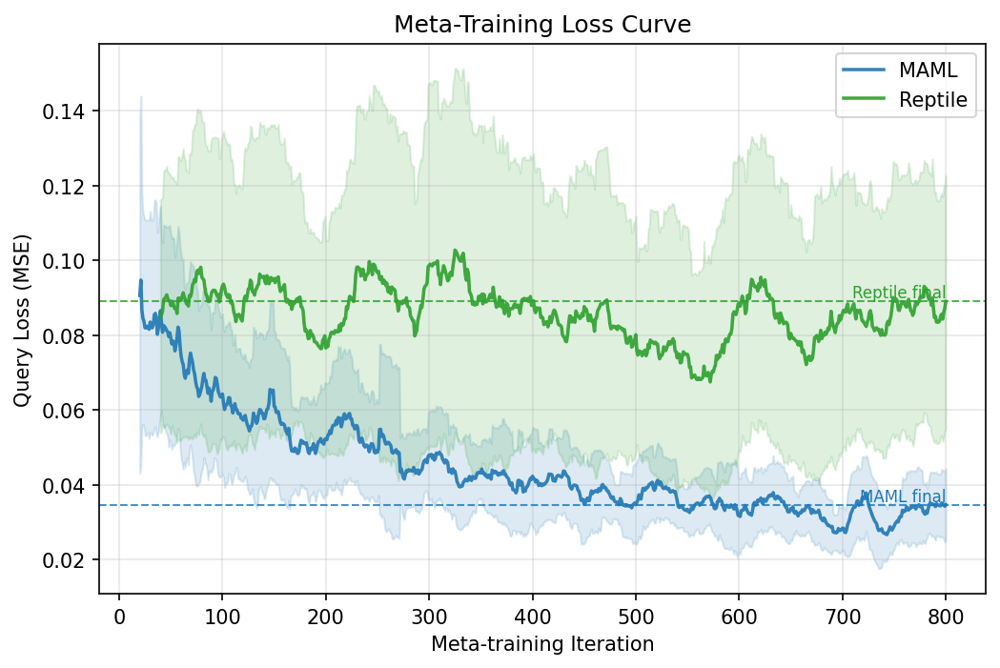
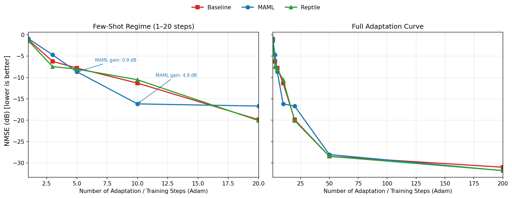

# Meta-Learning for Wireless Channel Estimation

**Task:** Channel Estimation — given noisy pilot observations, predict the full OFDM channel response.  
**Methods:** FOMAML and Reptile, compared against a scratch baseline trained separately on each unseen task.  
**Result:** MAML reaches **-16.2 dB NMSE** after only **10** adaptation steps, versus **-11.3 dB** for the from-scratch baseline at the same checkpoint.

## 1. What did I build?

I built a meta-learning system for OFDM channel estimation. The model is trained across many synthetic wireless environments with different SNR and multipath settings so it can adapt quickly to an unseen environment using only 10 support examples. I implemented both **FOMAML** and **Reptile** and compare them against a regular network trained from scratch on each new task.

## 2. How to set it up

git clone https://github.com/adhyatm19/Winter-projects-25-26.git
cd "Winter-projects-25-26/Model-Agnostic Meta-Learning (MAML)/Submissions/End Eval/MAML_240045_AdhyatmAgnihotri"
python3 -m pip install -r requirements.txt

If your local PyTorch install hits a macOS OpenMP warning, run the training and test commands with `KMP_DUPLICATE_LIB_OK=TRUE`.

## 3. How to generate data

```bash
python3 generate_data.py
```

This script creates **100 training tasks** and **20 test tasks** in `end_term/data/`. Each task is one wireless environment with a random multipath channel and SNR between **5 dB** and **25 dB**. Every task stores:

- `X_support`, `Y_support`: **20** support examples for adaptation
- `X_query`, `Y_query`: **50** query examples for evaluation

The data is saved as `.npz` files so it can be regenerated instead of committed.

## 4. How to train

```bash
python3 train.py
```

This trains **FOMAML** and **Reptile** and saves checkpoints in `end_term/checkpoints/`.

| Setting | Value |
|---|---|
| Outer optimizer | Adam (`lr = 0.001`) |
| Inner optimizer | Adam (`lr = 0.01`) |
| Inner loop steps | 5 |
| Support shots | 10 |
| Tasks per batch | 5 |
| Meta-iterations | 800 |
| Network | 3 layers x 64 neurons |
| Training seed | 42 |

It also saves `end_term/results/plot_loss.png`.

## 5. How to test

```bash
python3 test.py
```

This evaluates the models on **20 unseen test tasks**. MAML and Reptile are adapted for `1, 3, 5, 10, 20, 50, 200` steps. The baseline is trained from scratch on each task for **200** Adam steps and reported at the same checkpoints, which makes the few-shot comparison and the rubric-required 200-step baseline both visible.

Outputs:

- A printed NMSE table in dB for Baseline, MAML, and Reptile
- A printed few-shot comparison table for steps `1, 3, 5, 10`
- `end_term/results/plot_comparison.png`

## 6. Results

Average query NMSE over the 20 unseen tasks:

| **Method** | **5-step NMSE** | **10-step NMSE** | **20-step NMSE** | **200-step NMSE** |
|---|---|---|---|---|
| Baseline | -7.8 dB | -11.3 dB | -19.9 dB | -31.0 dB |
| MAML | **-8.7 dB** | **-16.2 dB** | -16.7 dB | **-31.8 dB** |
| Reptile | -8.0 dB | -10.5 dB | **-20.1 dB** | -31.8 dB |

### Few-Shot Advantage

| **Steps** | **Baseline NMSE** | **MAML NMSE** | **MAML gain over Baseline (dB)** |
|---|---|---|---|
| 1 | -1.2 dB | -0.9 dB | -0.3 dB |
| 3 | -6.2 dB | -4.7 dB | -1.5 dB |
| 5 | -7.8 dB | -8.7 dB | 0.9 dB |
| 10 | -11.3 dB | -16.2 dB | 4.9 dB |

Key takeaways:

- **MAML** gives the best few-shot performance at **5** and **10** adaptation steps.
- **Reptile** overtakes the scratch baseline by **20** steps.
- By **200** steps, both meta-learned initializations slightly outperform the scratch baseline.

### Training Loss Curve



### MAML vs Reptile vs Baseline


