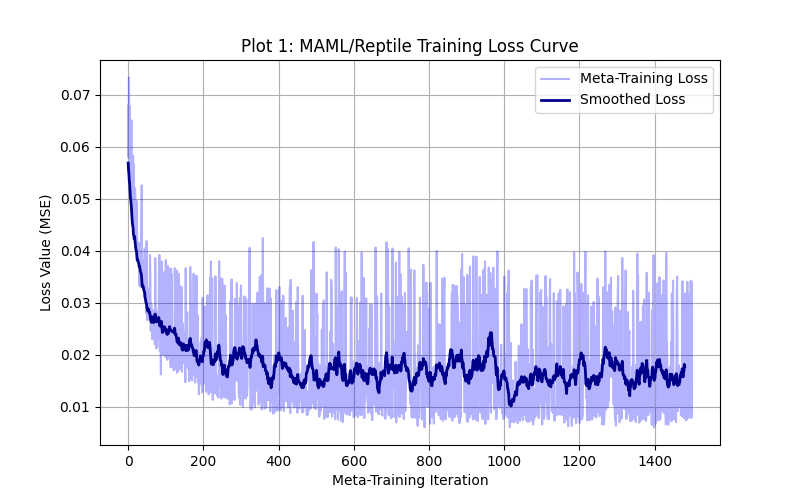
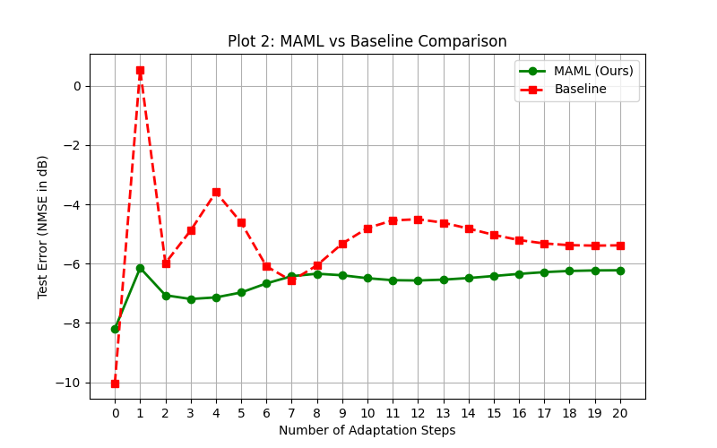

# Meta-Learning for Wireless Systems: Channel Estimation

## Part 1 — What did you build?

I built a neural network that learns how to adapt quickly to new wireless environments using only a few examples. I chose the **Channel Estimation** task, where the model is given noisy pilot signals and predicts the true channel (H).

Instead of training a new model from scratch every time the environment changes, I implemented **Reptile** (a highly efficient first-order alternative to MAML) so the model can generalize and adapt efficiently to new Signal-to-Noise Ratios (SNRs) and multipath profiles.

---

## Part 2 — How to set it up

Run the following commands to set up the project on your local machine:

```bash
git clone https://github.com/yadnyesh-24/Yadnyesh_241190_MAML_endeval.git
cd Yadnyesh_241190_MAML_endeval
python -m venv venv
venv\Scripts\activate
pip install -r requirements.txt
```

---

## Part 3 — How to generate data

```bash
python generate_data.py
```

This script creates synthetic wireless tasks using NumPy. It generates:

* 100 training tasks
* 20 test tasks

Each task represents a wireless environment with varying SNR (0 to 20 dB).

The dataset is saved to a compressed `.npz` file, separating:

* Support set (10 samples) → used for adaptation
* Query set (90 samples) → used for evaluation

---

## Part 4 — How to train

```bash
python train.py
```

This script runs the Reptile meta-training loop and also trains a baseline model from scratch.

### Key settings:

* Optimizer: Adam (inner + outer loops)
* Inner learning rate: 0.01
* Outer learning rate: 0.001
* Number of training tasks: 100
* Number of shots (adaptation steps): 5

---

## Part 5 — How to test

```bash
python test.py
```

This script:

* Loads trained models
* Evaluates on 20 unseen test tasks
* Performs 20 gradient steps using the support set
* Evaluates performance on the query set

### Output:

* Average **NMSE (dB)** over all test tasks
* Automatically generates plots in `results/`

---

## Part 6 — Results

Lower NMSE (more negative dB) indicates better performance.

| Method                     | 5-shot Error (NMSE) | 10-shot Error (NMSE)| 15-shot Error (NMSE)| 20-shot Error (NMSE)|
| -------------------------- | ------------------- | ------------------- | ------------------- | ------------------- |
| Basic model (from scratch) | -4.62 dB            | -4.80 dB            | -5.03 dB            | -5.38 dB            |
| Reptile (Meta-learning)    | -6.97 dB            | -6.49 dB            | -6.42 dB            | -6.22 dB            |

---

## Performance Visualizations

* `results/plot_loss.png`
  → Shows the meta-training loss decreasing over time


* `results/plot_comparison.png`
  → Compares Reptile vs Baseline across 0–5 adaptation steps
  → Demonstrates faster and better convergence of meta-learning

---

## Summary

The Reptile-based meta-learning model:

* Adapts quickly to new wireless environments
* Requires fewer samples
* Achieves lower NMSE compared to a baseline model

This demonstrates the effectiveness of meta-learning for wireless channel estimation tasks.
