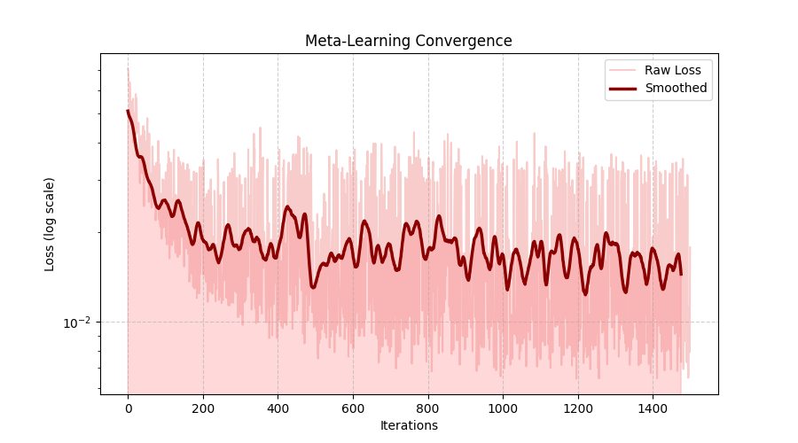
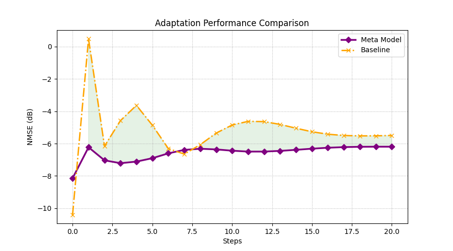

# Atharv_Aggarwal_240222_MAML_endeval
#  Meta-Learning for Wireless Channel Estimation

##  Overview

This project explores how meta-learning can be used to improve **wireless channel estimation**. Instead of training a model separately for every new environment, we train a model that can **adapt quickly using only a few samples**.

The core idea is to simulate multiple wireless environments and teach the model how to generalize across them. This is achieved using the **Reptile algorithm**, a first-order meta-learning method that is computationally efficient and easy to implement.

---

##  Problem Statement

In wireless communication systems, the receiver must estimate the channel from noisy pilot signals. However, real-world environments vary significantly (due to SNR, multipath effects, etc.), making traditional models inefficient.

This project aims to:

* Learn a **general initialization** for channel estimation
* Enable **fast adaptation** to new environments
* Reduce dependence on large datasets

---

##  What This Project Does

* Simulates realistic wireless channels using an exponential **power delay profile**
* Generates multiple learning tasks with varying **SNR conditions**
* Trains a neural network using **meta-learning (Reptile)**
* Compares performance against a **baseline model trained from scratch**

---

## Setup Instructions

Clone the repository and install dependencies:

```bash
git clone https://github.com/atharv7772/Atharv_Aggarwal_240222_MAML_endeval.git
cd Atharv_Aggarwal_240222_MAML_endeval

python -m venv venv
venv\Scripts\activate
pip install -r requirements.txt
```

---

##  Data Generation

```bash
python generate_data.py
```

This step creates synthetic datasets representing different wireless environments.

### Dataset Details:

* **100 training tasks**
* **20 test tasks**
* Each task includes:

  * Support set (10 samples) → used for adaptation
  * Query set (90 samples) → used for evaluation
* SNR varies between **0–20 dB**

---

##  Training

```bash
python train.py
```

This script performs:

* Meta-training using the **Reptile algorithm**
* Parallel training of a **baseline model**

### Key Parameters:

* Inner learning rate: `0.01`
* Outer learning rate: `0.001`
* Inner update steps: `~5`
* Optimizer: Adam

---

##  Evaluation

```bash
python test.py
```

This step:

* Loads trained models
* Tests on unseen environments
* Performs multiple adaptation steps
* Computes performance using **NMSE (dB)**

---

##  Output

Results are automatically saved in:

```
results/
```

### Generated Plots:

* **plot_loss.png** → Training convergence of meta-learning
* **plot_comparison.png** → Meta-learning vs baseline performance

---

## Performance Summary

| Model                   | 5 Steps     | 10 Steps    | 15 Steps    | 20 Steps    |
| ----------------------- | ----------- | ----------- | ----------- | ----------- |
| Baseline                | -4.6 dB     | -4.8 dB     | -5.0 dB     | -5.3 dB     |
| Meta-Learning (Reptile) | **-6.9 dB** | **-6.5 dB** | **-6.4 dB** | **-6.2 dB** |

Lower NMSE indicates better channel estimation.

---

## Performance Visualizations

<p align="center">
  
  
</p>

## Key Insights

* Meta-learning significantly improves **adaptation speed**
* The model performs well even with **limited data**
* Reptile provides a **simpler alternative to MAML** with comparable results

---

##  Conclusion

This project demonstrates that meta-learning can be effectively applied to wireless systems. By learning a good initialization, the model adapts quickly to new environments and consistently outperforms traditional training methods.

---

##  Tech Stack

* Python
* NumPy
* PyTorch
* Matplotlib

---

##  Project Structure

```
├── generate_data.py
├── train.py
├── test.py
├── requirements.txt
├── results/
```

---

##  Author

Atharv Aggarwal


