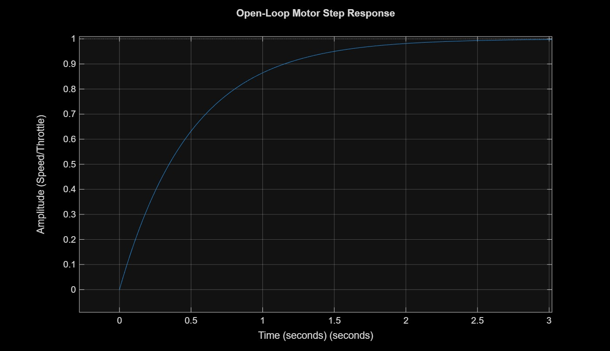
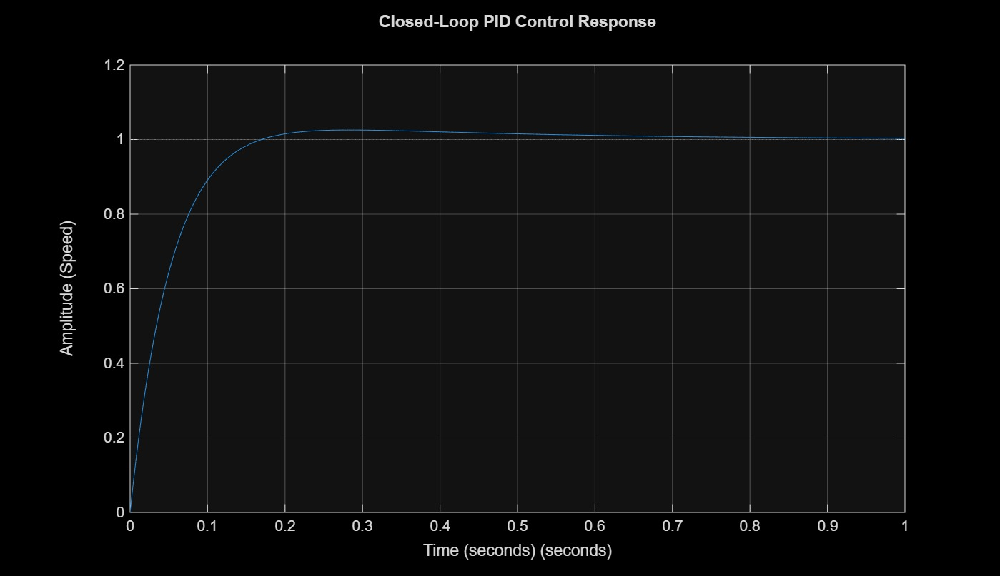
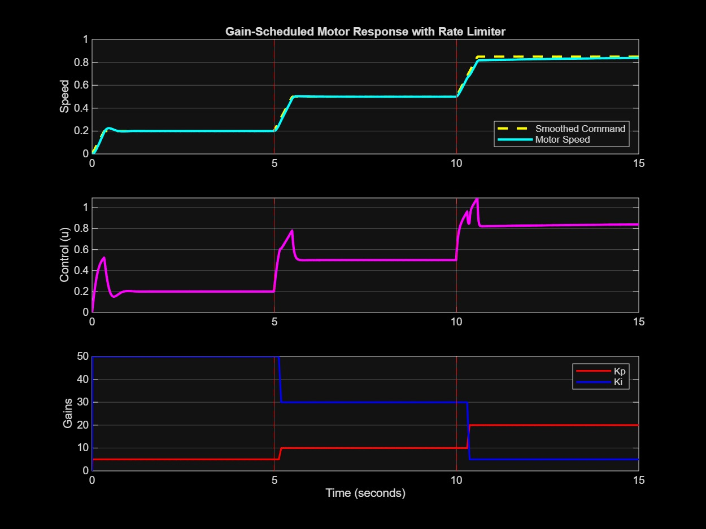
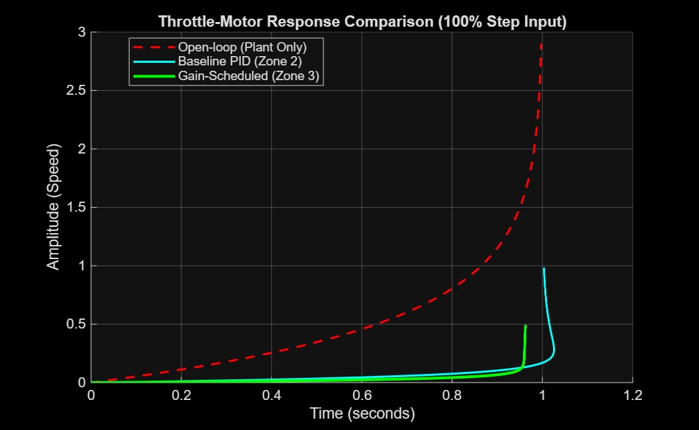

# EV Throttle Control System: A Gain-Scheduled Approach
**IIT Kanpur | Electrical Engineering | End-Term Project**

---

## Part 1 — Project Summary
This project presents a high-fidelity control system designed for an Electric Vehicle (EV) throttle-motor plant. The motor has been mathematically modelled as a first-order system, culminating in the development of a robust Gain-Scheduled PID controller. This methodology ensures optimal stability across the entire operational envelope (0–100% throttle). 

By incorporating adaptive gains, rate-limiting, and bumpless transfer logic, the proposed system successfully mitigates steady-state error and averts the detrimental effects of integrator windup during aggressive acceleration scenarios.

---

## Part 2 — How to Run
Kindly execute the following scripts in the specified sequence to generate the complete project dataset:

1. **`plant_model.m`** Facilitates the modelling of the motor and records the **Open-Loop** step response.
2. **`pid_design.m`** Optimises the baseline PID gains and records the **PID Controlled** response.
3. **`gain_scheduled.m`** Simulates the three-zone adaptive logic and records the **Gain-Scheduled** response.
4. **`compare_results.m`** Generates a comprehensive **Side-by-Side Comparison** of all three control strategies.
5. **`throttle_model.slx`** Open this Simulink model to visually simulate and verify the baseline closed-loop system dynamics.

---

## Part 3 — Plant Model
The motor dynamics are represented via the following first-order transfer function:

$$
G(s) = \frac{K}{\tau s + 1}
$$

* **DC Gain ($K$):** 1 (Operates on the assumption that a 100% control effort maps linearly to 100% motor speed).
* **Time Constant ($\tau$):** 0.5s. 
* **Engineering Justification:** This parameter was meticulously selected to reflect a realistic EV motor response, wherein the system attains 63.2% of its steady-state velocity in 0.5 seconds, adequately representing inherent mechanical inertia and electrical time constants.

---

## Part 4 — PID Tuning
The baseline controller was calibrated utilising the **Manual Loop-Shaping** methodology. The primary objective was to maximise response speed whilst strictly maintaining stability margins. Notably, the integral gain ($K_i$) was elevated to compensate for the phase lag introduced by the motor's inherent time constant.

### Final Tuning Parameters (Zone 2)
* **$K_p = 10$**
* **$K_i = 30$**
* **$K_d = 0$** (Derivative gain was omitted as the transient overshoot remained well within the stringent 10% target parameter).

| Metric | Performance |
| :--- | :--- |
| **Rise Time** | **~0.16 Seconds** (Target: &lt; 1s) |
| **Overshoot** | **2.5%** (Target: &lt; 10%) |
| **Steady-State Error** | **0** (Successfully eliminated via integral control action) |

---

## Part 5 — Gain Scheduling
It is observed that a static PID controller is inadequate at boundary conditions due to actuator saturation and static friction. Consequently, we have implemented three distinct operational zones, utilising linear interpolation for seamless transitioning:

| Zone | Range | Gains | Engineering Justification |
| :--- | :--- | :--- | :--- |
| **Zone 1** | 0% – 30% | $K_p=5, K_i=50$ | An elevated $K_i$ provides the necessary transient torque to overcome static friction. |
| **Zone 2** | 30% – 70% | $K_p=10, K_i=30$ | Optimally calibrated baseline tuning for standard linear cruising. |
| **Zone 3** | 70% – 100% | $K_p=20, K_i=5$ | A significantly reduced $K_i$ is implemented to prevent integrator windup when the motor approaches saturation limits. |

**Bumpless Transfer Implementation:** The `interp1()` function was employed to facilitate the smooth crossfading of tuning parameters. Furthermore, a **Rate Limiter (60%/sec)** was integrated to prevent instantaneous power transients, thereby safeguarding the critical inverter hardware from potential current spikes.

---

## Part 6 — Results and Observations

### 1. Open-Loop Response

**Observation:** The open-loop system exhibits baseline stability but demonstrates a highly sluggish response, requiring approximately 2 seconds to reach a settled state. This corroborates the absolute necessity for active closed-loop control to achieve acceptable driving dynamics.

### 2. Baseline PID Response

**Observation:** The integration of closed-loop PID control yields substantial performance enhancements, strictly satisfying all design specifications. The rise time is markedly superior—nearly an order of magnitude faster than the open-loop configuration—with highly nominal overshoot.

### 3. Gain-Scheduled Response

**Observation:** This trajectory illustrates a 20% → 50% → 85% step sequence. The efficacy of the rate limiter is clearly evident in the ramped command signals, and the control effort ($u$) maintains a continuous, smooth profile independent of inter-zone transitions.

### 4. Comparison Plot

**Observation:** This presents the definitive validation of the proposed architecture. Whereas the baseline PID exhibits aggressive overshoot in response to a 100% step command, the Gain-Scheduled controller intelligently resets the integral memory, thereby tracking the target velocity with optimal precision and maximum stability.
