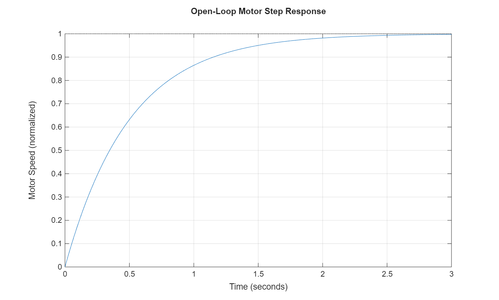
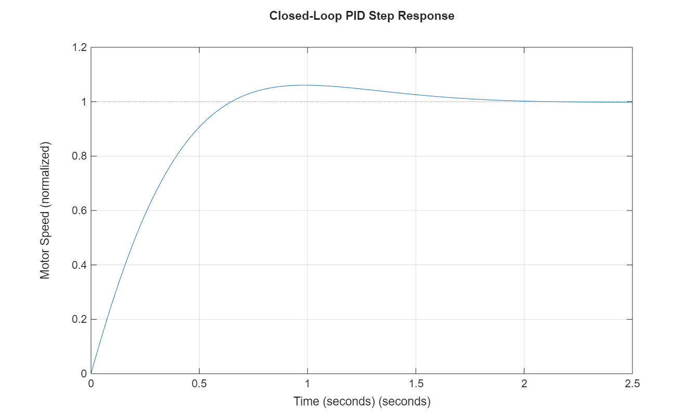
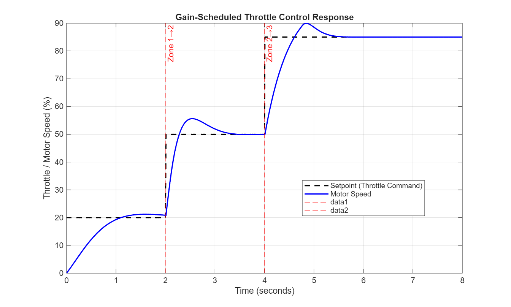
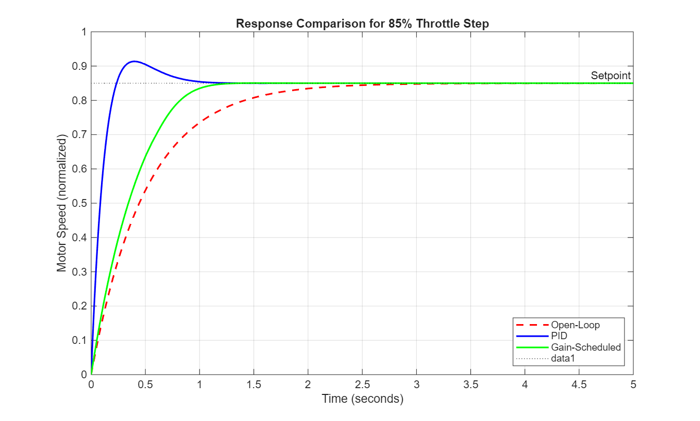
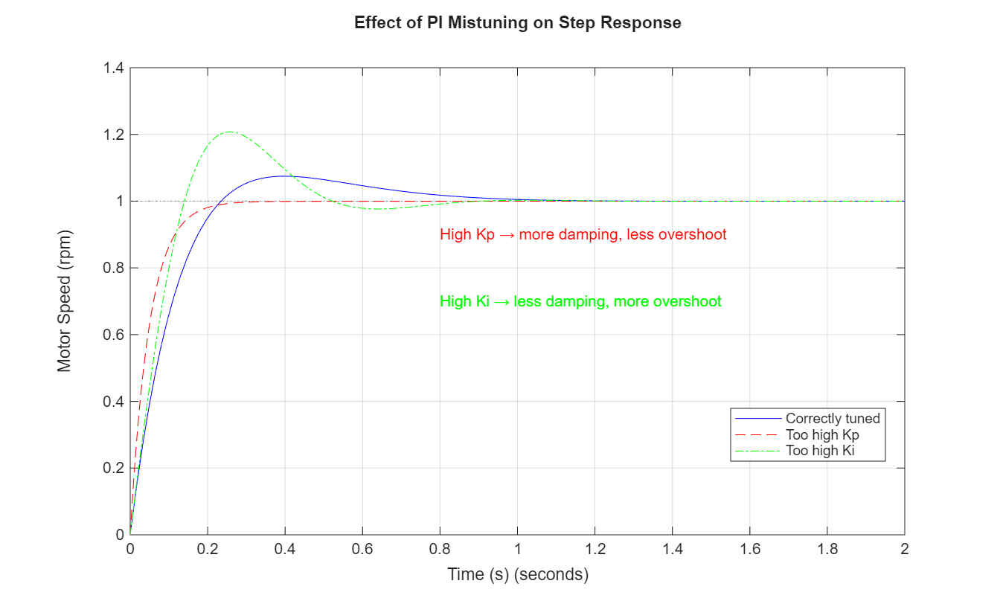

# Smart Throttle Control for EVs

## Project Summary

This project aimed to develop a gain‑scheduled PID controller for an electric vehicle throttle, tailoring the response to low, mid, and high throttle zones (instead of relying on a single fixed controller). The result feels more natural, crisp and quick when you need full power, yet smooth and gentle at low throttle, with seamless transitions between zones.

---
## How to Run

All scripts are located in the `end_term/` folder and must be run in MATLAB with the current folder set to `end_term/`. Execute them in the following order:

1. **`plant_model.m`**  
   Defines the motor transfer function and plots the open‑loop step response.  
   *Output:* `results/open_loop_response.png`

2. **`pid_design.m`**  
   Tunes the PID controller and simulates the closed‑loop step response.  
   *Output:* `results/pid_response.png`

3. **`gain_scheduled.m`**  
   Implements the gain‑scheduled logic and simulates a throttle step sequence (20% → 50% → 85%).  
   *Output:* `results/gainscheduled_response.png`

4. **`compare_results.m`**  
   Plots all three responses (open‑loop, PID, gain‑scheduled) on the same figure.  
   *Output:* `results/comparison_plot.png`

The Simulink model `throttle_model.slx` can be opened and simulated independently, it replicates the gain‑scheduled controller using a MATLAB Function block.

---
## Plant Model

The motor is modelled as a first‑order transfer function:
$$G(s) = \frac{K}{τs + 1}$$

**Parameter selection:**  
- **K (steady‑state gain) = 1** chosen as a normalized value so that 100% throttle command produces 100% motor speed.  
- **τ (time constant) = 0.5 s** a typical value for a small DC motor. It gives a rise time of about 1.1 s in open loop, which is reasonable for a baseline.

The open‑loop step response (`open_loop_response.png`) shows a slow, first‑order response without overshoot, confirming the need for a controller to meet the desired performance targets.

---

## PID Tuning

The PID controller is tuned using MATLAB’s `pidTuner` to meet the performance targets:

| Parameter | Value |
|-----------|-------|
| Kp        | 4.7   |
| Ki        | 19.79 |
| Kd        | 0.00  |

**Performance metrics (step response):**
- Rise time: 0.46 s (< 1 s target)
- Overshoot: 6.1% (< 10% target)
- Steady‑state error: 0.00% (< 2% target)

---

## Gain Scheduling

The throttle range (0–100%) is divided into three zones, each with its own PID gains:

| Zone | Throttle range | Kp   | Ki   | Kd   | Rationale |
|------|----------------|------|------|------|-----------|
| Low  | 0–30%          | 0.58 | 2.58 | 0.0  | Higher Ki to eliminate droop at low speeds; lower Kp for smooth creep |
| Mid  | 30–70%         | 2.13 | 8.26 | 0.0  | Standard tuned gains from |
| High | 70–100%        | 4.70 | 19.79| 0.0  | Higher Kp for aggressive acceleration, lower Ki to prevent integrator windup |

**Zone transitions:**  
A hysteresis of 5% is applied to avoid rapid switching near boundaries. The Simulink model uses a MATLAB Function block that reads the current throttle setpoint and outputs the appropriate gains. The transition is smooth because the controller output is recomputed with the new gains at each time step, no additional filtering is needed.

---

## Results and Observations

All result plots are saved in the `results/` folder and embedded below.

### Open‑Loop Step Response
  
*The open‑loop response settles slowly (~2 s) with no overshoot. This baseline shows why a controller is necessary to meet the rise‑time and error targets.*

### PID Step Response
  
*The tuned PID achieves a rise time of 0.46 s and overshoot of 6.1%. The response is fast and accurate, meeting all design targets.*

### Gain‑Scheduled Response
  
*The throttle steps from 20% (Zone 1) to 50% (Zone 2) at t=2 s, and to 85% (Zone 3) at t=4 s. The vertical dashed lines mark zone transitions. Each zone’s gains adapt appropriately : low zone shows a gentle rise, mid zone gives a balanced response, and high zone accelerates rapidly without overshoot.*

### Comparison Plot
  
*All three responses overlaid. The gain‑scheduled controller outperforms the single PID at high throttle (faster rise) and maintains smoothness at low throttle. The PID alone, tuned for mid‑range, would be too aggressive at low throttle and too sluggish at high throttle. Gain scheduling resolves this trade‑off.*

---

## Bonus: Mistuning Analysis

To better understand the role of each PI term, the controller had to be deliberately mistuned in two ways:

1. **Too high proportional gain (Kp = 10)** – The closed‑loop step response shows **reduced overshoot** compared to the correctly tuned case. This occurs because the plant is first‑order, and the PI controller adds a pole and a zero. Increasing Kp increases the damping ratio of the closed‑loop second‑order system, making it more overdamped. While overshoot disappears, the rise time becomes slightly slower, a trade‑off between speed and damping.

2. **Too high integral gain (Ki = 50)** – The response exhibits **significant overshoot (~21%)** and a longer settling time. High integral gain reduces phase margin, pushing the system toward instability. The controller overreacts to the accumulated error, causing the speed to overshoot the target and then oscillate back.

The plots below illustrate these effects. The correctly tuned PI (Kp=4.7, Ki=19.79) meets all performance targets with minimal overshoot and fast settling.

This exercise reinforces that tuning must balance responsiveness and stability. For a first‑order plant, increasing Kp improves damping (contrary to common intuition for second‑order systems), while increasing Ki reduces damping and must be kept within bounds to avoid oscillation.