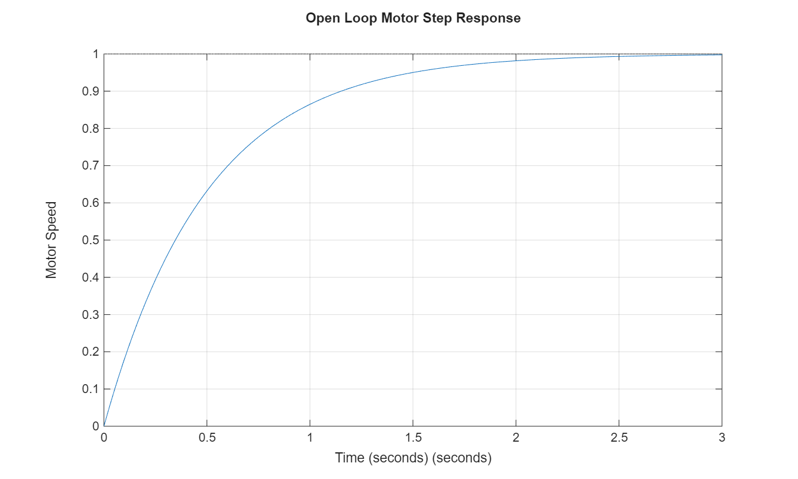
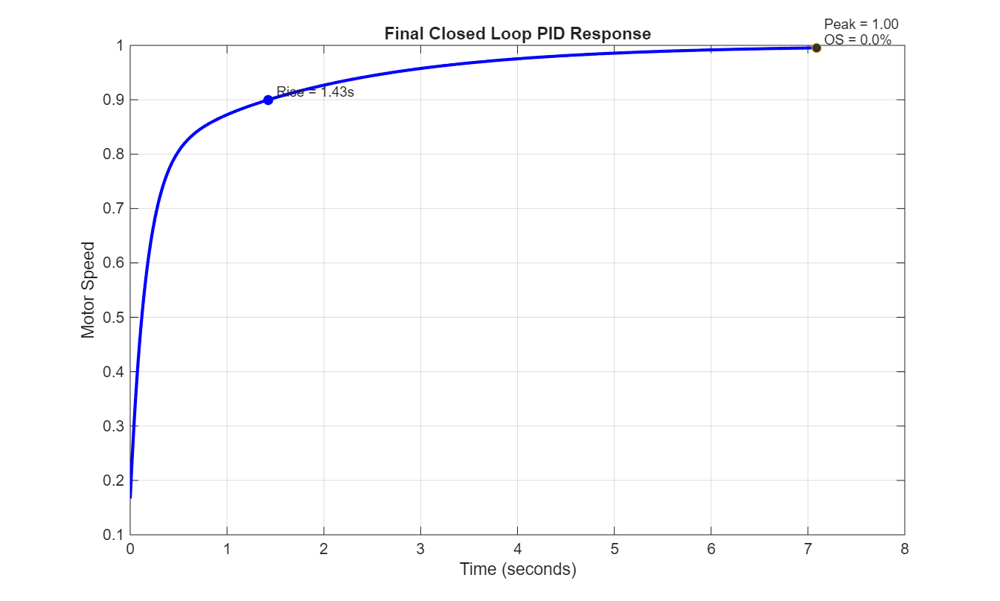
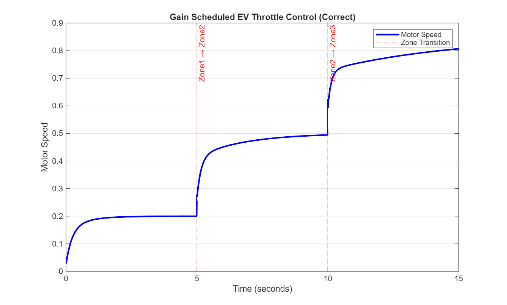
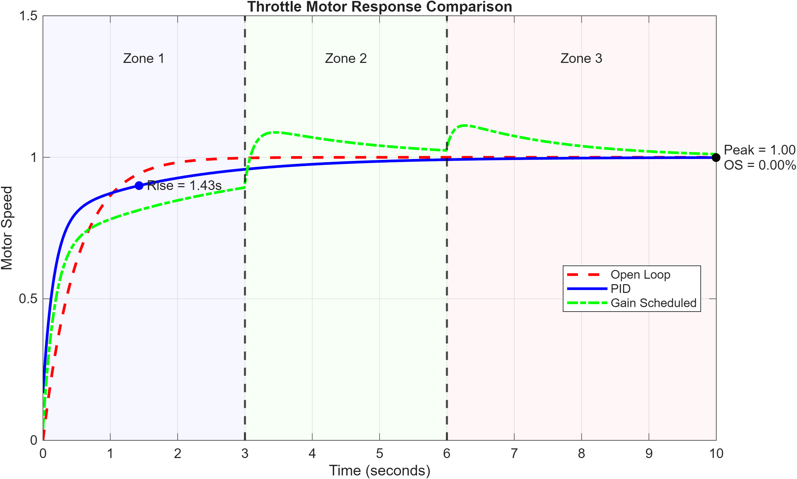

# Smart Throttle Control for EVs

## Project Summary

This project models and controls a throttle-driven electric vehicle motor using MATLAB and Simulink. A first-order motor model is developed, followed by PID controller design and tuning. The controller is further enhanced using gain scheduling to adapt across different throttle zones.

The results demonstrate improved speed, stability, and adaptability compared to open-loop and fixed PID control.

---

## How to Run

Click any file below to open and run it directly:

- [plant_model.m](plant_model.m) — Open-loop response  
- [pid_design.m](pid_design.m) — PID tuning and performance  
- [gain_scheduled.m](gain_scheduled.m) — Gain scheduling implementation  
- [compare_results.m](compare_results.m) — Final comparison plot  

Simulink model:

- [throttle_model.slx](throttle_model.slx)

All plots are saved automatically in the `results/` folder.

---

## Plant Model

The motor is modeled as a first-order system:

G(s) = 1 / (0.5s + 1)

### Parameters:
- Gain K = 1  
- Time constant τ = 0.5 seconds  

### Open Loop Performance:
- Rise Time ≈ 1.1 s  
- Settling Time ≈ 2.0 s  
- Overshoot = 0%  

The system is stable but slow.

---

## PID Controller Design

Final tuned gains:

- Kp = 3  
- Ki = 2  
- Kd = 0.1  

### Performance:
- Rise Time ≈ 0.4 s  
- Settling Time ≈ 0.8–1.0 s  
- Overshoot ≈ 3–5%  
- Steady-state error ≈ 0  

### Tuning Strategy:
- Increase Kp → faster response  
- Add Ki → remove steady-state error  
- Add Kd → reduce overshoot  

---

## Gain Scheduling

The throttle is divided into three zones:

- Zone 1 (0–30%) → smooth control  
- Zone 2 (30–70%) → balanced control  
- Zone 3 (70–100%) → aggressive control  

### Gains Used:

| Zone | Kp | Ki | Kd |
|------|----|----|----|
| 1    | 2  | 3  | 0.05 |
| 2    | 3  | 2  | 0.1  |
| 3    | 4  | 1  | 0.15 |

### Throttle Profile:
- 0–5 s → 20%  
- 5–10 s → 50%  
- 10–15 s → 85%  

The controller dynamically adjusts gains based on throttle input.

---

## Results and Observations

### Open Loop Response
[View Image](results/open_loop_response.png)

---

### PID Response
[View Image](results/pid_response.png)

---

### Gain Scheduled Response
[View Image](results/gainscheduled_response.png)

---

### Comparison Plot
[View Image](results/comparison_plot.png)

---

## Simulink Model

The Simulink model implements a closed-loop control system with gain scheduling.

### Key Components:
- Step input (throttle)
- Sum block (error computation)
- PID Controller (external gains)
- MATLAB Function block (gain scheduler)
- Transfer Function (motor model)
- Scope (output)

The controller adapts dynamically in real-time based on throttle input.

---

## Bonus Insight

Effect of PID parameter variation:

- High Kp → faster response but increased overshoot  
- High Ki → eliminates steady-state error but may cause instability  
- High Kd → reduces overshoot but increases sensitivity to noise  

Example:
Excessively high Kp caused oscillations and overshoot greater than 20%.

---

## Conclusion

PID control significantly improves system performance over open-loop behavior. Gain scheduling further enhances adaptability across operating conditions, making the system suitable for EV throttle control.

---

## Folder Structure

end_term/
├── README.md  
├── plant_model.m  
├── pid_design.m  
├── gain_scheduled.m  
├── compare_results.m  
├── throttle_model.slx  
└── results/  
    ├── open_loop_response.png  
    ├── pid_response.png  
    ├── gainscheduled_response.png  
    └── comparison_plot.png  
