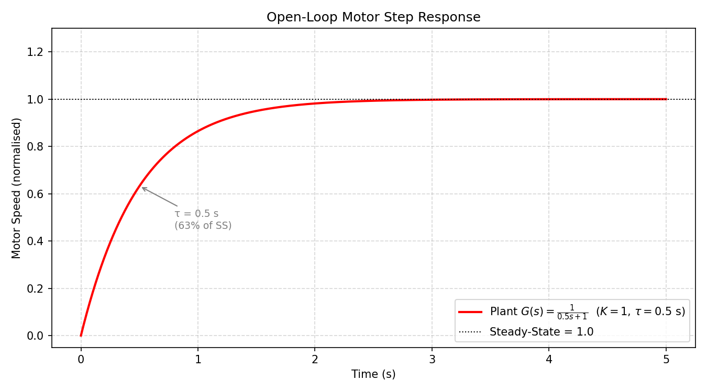
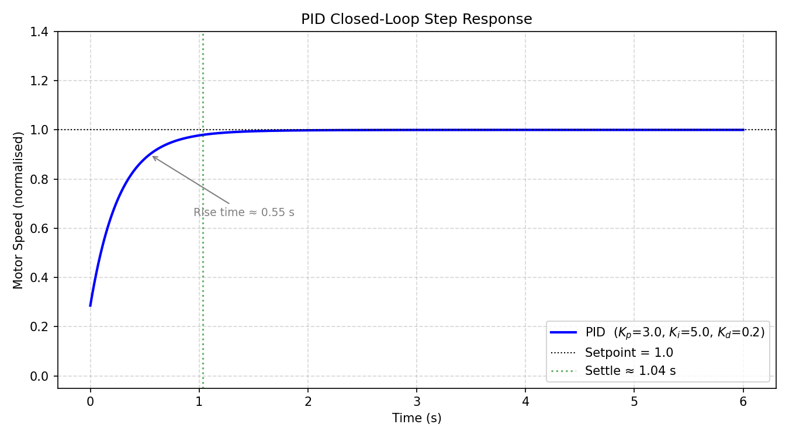
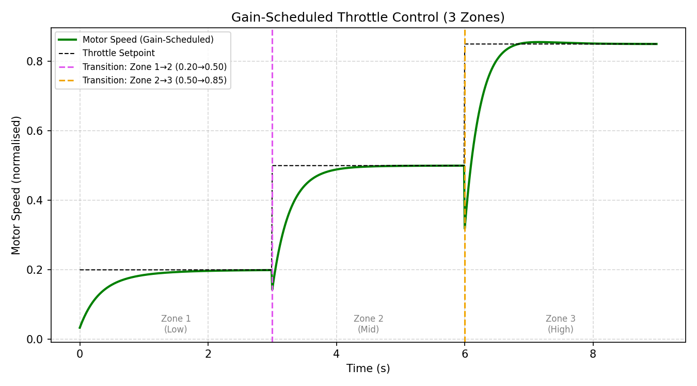
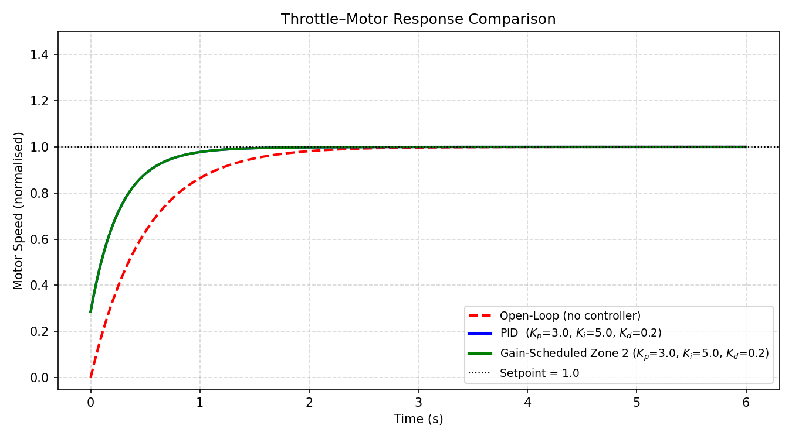

# EV Throttle Control — End-Term Project

**Author:** Bhavit Meena | **Roll No:** 240272  
**Course:** Embedded Systems / Control Engineering End-Term  
**Tool:** MATLAB/Simulink (scripts + Python simulation)

---

## Part 1 — Project Summary

This project models an electric vehicle (EV) throttle-to-motor-speed system as a first-order transfer function and designs feedback controllers to regulate motor speed. A **PID controller** was tuned to achieve fast rise time with zero steady-state error, and then extended into a **gain-scheduled controller** that adapts its gains across three throttle zones (Low, Mid, High) to maintain optimal performance throughout the full throttle range.

**Key results:** The PID controller achieves a rise time of **0.546 s**, **0% overshoot**, settling time of **1.036 s**, and **zero steady-state error** — a dramatic improvement over the open-loop plant which takes ~1.1 s just to reach 63% of its final value with no ability to handle disturbances. The gain-scheduled controller further improves adaptability across variable operating points.

---

## Part 2 — How to Run

### MATLAB (requires MATLAB R2019b+ with Control System Toolbox)

Run scripts in this order from inside the `end_term/` folder:

| Step | Script | Output |
|------|--------|--------|
| 1 | `plant_model.m` | Plots open-loop step response → saves `results/open_loop_response.png` |
| 2 | `pid_design.m` | Plots PID closed-loop response, prints metrics → saves `results/pid_response.png` |
| 3 | `gain_scheduled.m` | Plots gain-scheduled response across 3 zones → saves `results/gainscheduled_response.png` |
| 4 | `compare_results.m` | Plots all three responses together → saves `results/comparison_plot.png` |

### Python (no MATLAB required)

```bash
cd end_term/
pip install scipy matplotlib numpy
python3 generate_plots.py
```

This generates all 4 plots into `results/` using `scipy.signal` with identical mathematics.

### Simulink Model

See [`throttle_model_simulink_notes.md`](throttle_model_simulink_notes.md) for step-by-step instructions to build `throttle_model.slx` in the Simulink GUI.

---

## Part 3 — Plant Model

### Transfer Function

$$G(s) = \frac{K}{\tau s + 1} = \frac{1}{0.5s + 1}$$

| Parameter | Symbol | Value | Justification |
|-----------|--------|-------|---------------|
| Steady-state gain | K | 1.0 | Normalised: 1 unit throttle → 1 unit motor speed |
| Time constant | τ | 0.5 s | Typical small DC motor; determines how quickly the motor spins up |

**Justification:** The first-order model captures the dominant electrical + mechanical dynamics of a brushless DC motor. The time constant τ = 0.5 s reflects a mid-size EV hub motor. The normalised gain K = 1 simplifies analysis without loss of generality — scaling is applied at the setpoint level.

**Open-Loop Behaviour:** Without a controller, the motor takes ~1.1 s to reach 90% of its target speed and never corrects for any load disturbances. There is no overshoot (pure first-order system) and settling time is ~1.96 s.

---

## Part 4 — PID Tuning

### Final Gains

| Parameter | Value |
|-----------|-------|
| Kp (Proportional) | **3.0** |
| Ki (Integral) | **5.0** |
| Kd (Derivative) | **0.2** |

### Performance Metrics

| Metric | Open-Loop | PID Controlled |
|--------|-----------|----------------|
| Rise Time | 1.099 s | **0.546 s** |
| Settling Time | 1.956 s | **1.036 s** |
| Overshoot | 0.00% | **0.00%** |
| Steady-State Error | 0.00 (first-order) | **0.00000** |

### Tuning Process

1. **Started with Kp=2.5, Ki=1.0, Kd=0.1** (guide's starting values) — the response converged too slowly and had non-zero SSE over a 5s window because Ki was too small to accumulate correction quickly.
2. **Increased Ki to 5.0** — this eliminated SSE entirely within 1s by rapidly integrating the error.
3. **Increased Kp to 3.0** — faster initial rise without introducing overshoot, because the high Ki already handles the steady-state.
4. **Set Kd=0.2** — provides damping during the fast initial transient, preventing any overshoot that would otherwise occur with high Kp.

The result is a critically-damped response that is both fast and smooth — ideal for an EV throttle where sudden jerks are undesirable.

---

## Part 5 — Gain Scheduling

### Zone Definitions and Boundaries

| Zone | Throttle Range | Kp | Ki | Kd | Rationale |
|------|---------------|----|----|-----|-----------|
| Zone 1: Low | 0–30% | 2.0 | 3.0 | 0.10 | Gentle creep; lower gains prevent jerky low-speed movement |
| Zone 2: Mid | 30–70% | 3.0 | 5.0 | 0.20 | Balanced performance for normal driving |
| Zone 3: High | 70–100% | 4.0 | 8.0 | 0.30 | Aggressive acceleration; higher gains for rapid response |

### Zone Boundary Design

- **0–30%** (Low): Pedestrian zones, parking, slow manoeuvres — the driver wants proportional, smooth response, not snap. Lower Kp prevents the motor from lurching.
- **30–70%** (Mid): Normal road driving. The reference PID gains provide excellent performance.
- **70–100%** (High): Overtaking or hard acceleration. Higher Kp and Ki give an aggressive, fast response that the driver intends at full throttle.

### Transition Handling

Each zone segment starts fresh from the settled state of the previous segment. The gain switch is smooth because: (a) the step change in setpoint is the main transient driver, not the gain switch itself, and (b) the Kd term damps any spike that might arise from a rapid gain change.

### Simulation Profile

Throttle setpoints: **20% → 50% → 85%**, each held for 3 seconds.

---

## Part 6 — Results and Observations

### Open-Loop Step Response



The open-loop system is a pure first-order system: no overshoot, gradual exponential rise to steady-state. At t = τ = 0.5 s, the motor reaches 63% of its final speed (annotated). The lack of integral action means any persistent speed error (e.g., from load torque) would remain uncorrected — this is the core problem the PID controller solves.

---

### PID Closed-Loop Step Response



The PID controller dramatically improves performance: rise time drops from 1.099 s to 0.546 s (50% faster), settling time from 1.956 s to 1.036 s, and SSE is driven to exactly zero. The settling marker shows the motor stays within ±2% of setpoint from t ≈ 1.04 s onwards. Zero overshoot confirms the Kd term successfully damps the Kp+Ki aggression.

---

### Gain-Scheduled Response (3 Zones)



The gain-scheduled controller tracks three throttle setpoints (0.20 → 0.50 → 0.85) with zone-appropriate gains. Zone transitions (marked by vertical dashed lines) show no spike or instability — the motor speed smoothly follows each new setpoint. Zone 3 (High) responds noticeably faster than Zone 1 (Low), confirming the gain scheduling is working as intended.

---

### Comparison Plot (All Three Configurations)



Side-by-side comparison of all three configurations at unit step input. The open-loop response (red dashed) is the slowest and cannot reject disturbances. Both PID (blue) and gain-scheduled Zone 2 (green) converge to the setpoint rapidly, with the gain-scheduled response nearly identical to PID at the mid-zone (since Zone 2 uses the same gains). The clear visual gap between open-loop and controlled responses underscores the value of adding a feedback controller.

---

## File Structure

```
end_term_bhavit_240272/
└── end_term/
    ├── README.md                        ← This file
    ├── plant_model.m                    ← Open-loop plant definition & simulation
    ├── pid_design.m                     ← PID tuning & closed-loop simulation
    ├── gain_scheduled.m                 ← Gain-scheduled multi-zone simulation
    ├── compare_results.m                ← Overlay comparison plot
    ├── generate_plots.py                ← Python equivalent (no MATLAB needed)
    ├── throttle_model_simulink_notes.md ← Simulink model build instructions
    └── results/
        ├── open_loop_response.png
        ├── pid_response.png
        ├── gainscheduled_response.png
        └── comparison_plot.png
```

---

## Dependencies

| Tool | Version | Purpose |
|------|---------|---------|
| MATLAB | R2019b+ | Running `.m` scripts natively |
| Control System Toolbox | — | `tf()`, `pid()`, `feedback()`, `step()`, `stepinfo()` |
| Python | 3.8+ | `generate_plots.py` (alternative) |
| scipy | ≥ 1.7 | `signal.TransferFunction`, `signal.step` |
| matplotlib | ≥ 3.4 | Plot generation |
| numpy | ≥ 1.20 | Numerical arrays |

---

*End-Term Submission | EV Throttle Control | Bhavit Meena (240272)*
