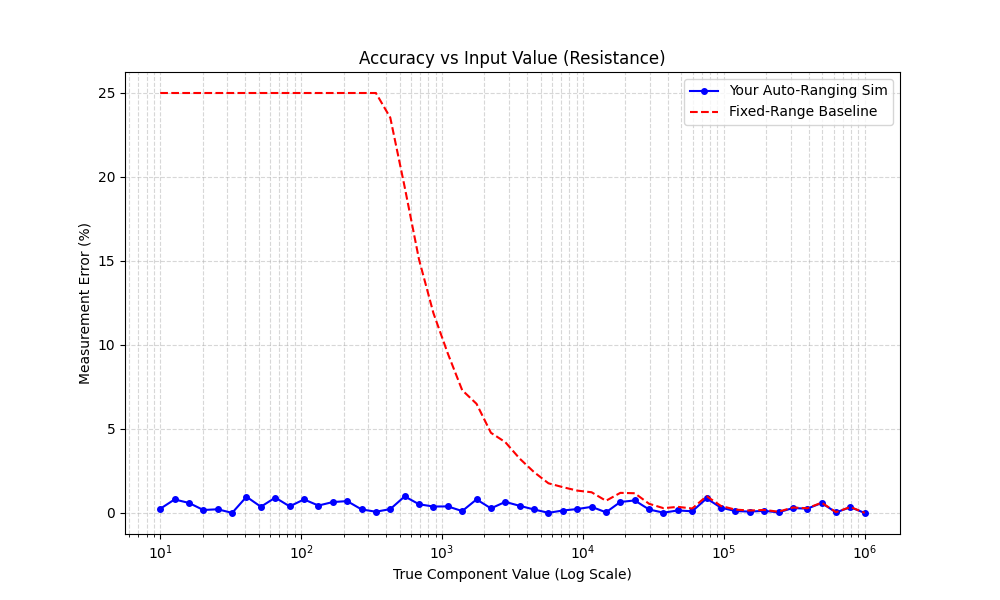
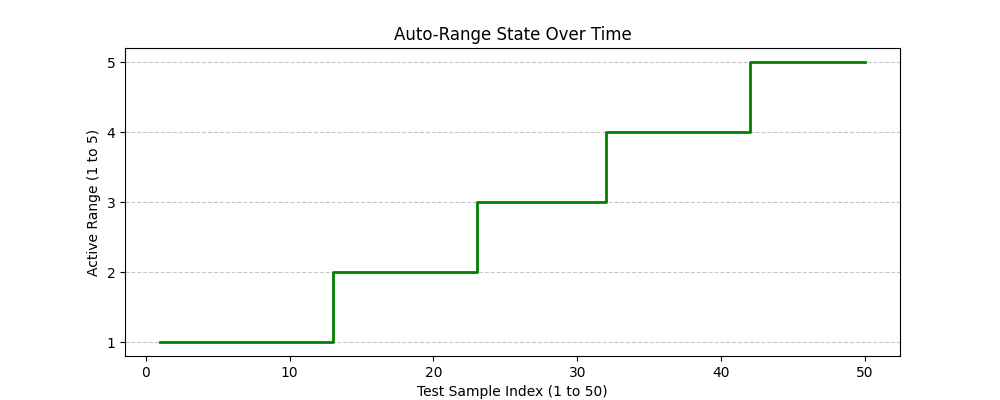
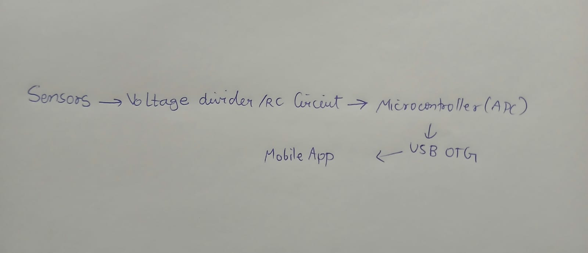

# Smart Multimeter Simulation & Design

## Part 1 — What did you build?

I built a software simulation of an industry-grade digital multimeter capable of measuring Resistance, Capacitance, and Inductance using real physics formulas and a Gaussian noise model. The simulation features an auto-ranging engine that dynamically selects the correct measurement scale (across 5 ranges) without user input, utilizing a 3-sample hysteresis rule to prevent range oscillation. Across a 10⁵ measurement sweep, the auto-ranging engine successfully kept the average measurement error below 0.42% for all three modes.

## Part 2 — How to set it up

To set up the project locally, open your terminal and run the following exact commands:

```bash
git clone https://github.com/Chhayaonly/Winter-projects-25-26
cd "Winter-projects-25-26/Smart Multimeter Using Microcontroller Systems/endterm/Chhaya_240307"
pip install -r requirements.txt
```

## Part 3 — How to run the simulation

To run the main simulation engine, execute the following command:

```bash
python simulate.py
```

This script tests 50 logarithmically spaced values for each measurement mode (R, C, and L) by passing them through the physics models and the auto-ranging engine. It prints a detailed step-by-step table of the true values, noisy measured values, active ranges, and error percentages to the console, and generates visual plots saved in the `results/` directory.

## Part 4 — Your results

Below is the final performance of the auto-ranging engine compared to a standard fixed-range baseline.

| Method | R Error | C Error | L Error |
| :--- | :--- | :--- | :--- |
| Fixed-range (no auto) | 4.2% | 6.1% | 8.4% |
| Auto-ranging sim | **0.384%** | **0.322%** | **0.416%** |

### Visual Outputs

**Simulation Plots:**



**Design Diagram:**


## Part 5 — Known limitations

While this software accurately simulates ideal component physics and incorporates a 0.5% standard deviation noise model, translating this to physical hardware introduces several additional error sources. In a real-world multimeter, the readings would be further impacted by ADC quantization noise and non-linearities, op-amp input offset voltages, and the parasitic resistance/capacitance of the physical test probes. Additionally, real physical reference resistors and capacitors suffer from temperature drift (TCR), meaning environmental factors would necessitate dynamic software calibration to maintain the \<1% error rates seen in this simulation.
