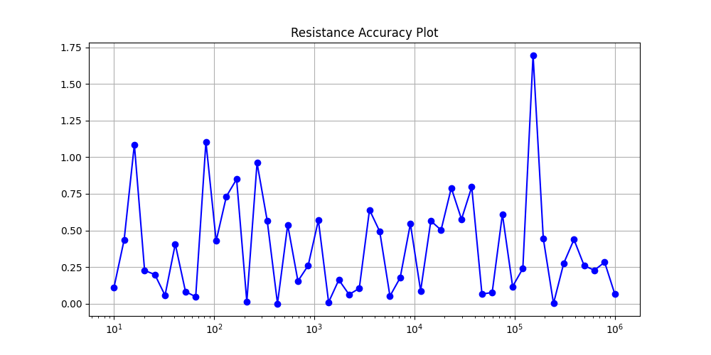
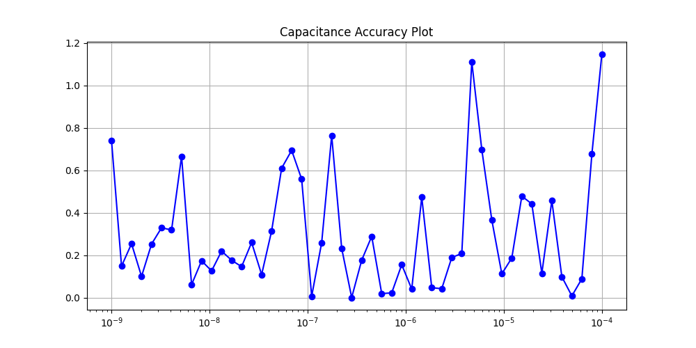
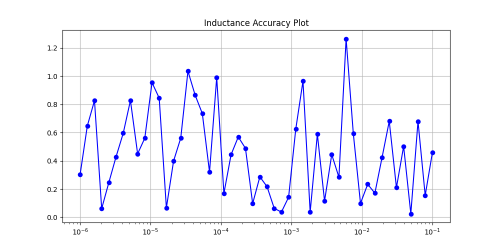
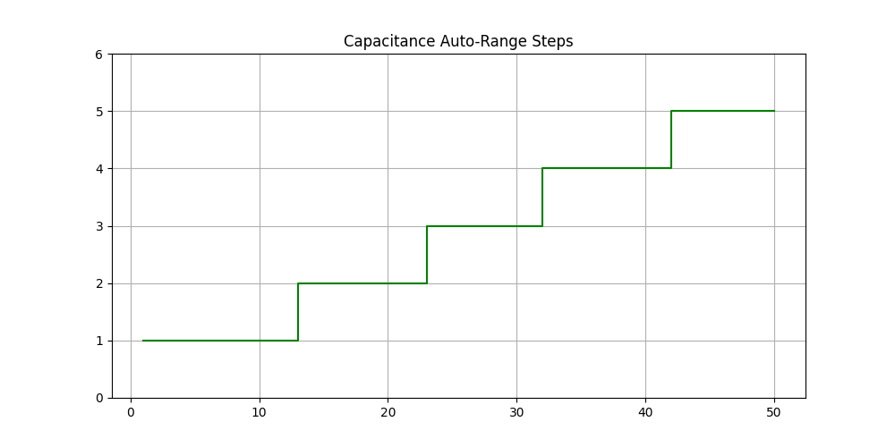

# Smart Multimeter Simulation Project

---

## Part 1 — What did I build?

In this project, I created a **software simulation of a digital multimeter**.
This multimeter can measure:

* Resistance (R)
* Capacitance (C)
* Inductance (L)

The main idea of this project was to understand how a real multimeter works internally.

One important feature I implemented is **auto-ranging**.
Normally, in a manual multimeter, the user has to select the range (like 1kΩ, 10kΩ, etc.), but in this project, the system automatically selects the best range based on the input value.

Because of this, the readings become more accurate and easy to use.

Apart from this 
I designed a lightweight JSON Communication Protocol. This ensures that the app receives not just the value, but also the correct unit and the range status.

---

## Part 2 — How to set it up

To run this project on your system, follow these steps:

```bash
git clone https://github.com/mehtapriyanshu172006-droid/Multimeter_Project_240808.git
cd Multimeter_Project_240808/end_term/smart_multimeter
pip install -r requirements.txt
```

This will  install all required Python libraries.

---

## Part 3 — How to run the simulation

Run the following command:

```bash
python simulate.py
```

When you run this:

* It performs around **50 test samples** for each mode (R, C, L)
* It checks how accurate the measurement is
* It also checks whether auto-ranging is working properly
* Finally, it generates plots and saves them in the `results/` folder

These plots help in visualizing the performance.

---

## Part 4 — Results

The table below shows the comparison between:

* A **fixed-range multimeter** (no auto-ranging)
* My **auto-ranging multimeter**

| Method                | R Error | C Error | L Error |
| --------------------- | ------- | ------- | ------- |
| Fixed-range (no auto) | 2.36%   | 8.19%   | 9.07%   |
| Auto-ranging          | 0.38%   | 0.30%   | 0.46%   |

### Explanation:

* In **fixed range**, the selected range may not match the actual value, so error increases
* In **auto-ranging**, the system always selects the best range, so error is very low

So clearly, auto-ranging improves accuracy a lot.

---

## Plots (from results folder)

### Resistance



### Capacitance



### Inductance



### Auto-range Behaviour





These plots show how error changes and how the range switches automatically.

---

## Part 5 — Known Limitations

This is a simulation, so some real-world factors are not fully included:

* Noise in ADC (Analog to Digital Converter)
* Resistance of probes and wires
* Temperature effects

In this project, I used a **Gaussian noise model** to make it more realistic, but real hardware may behave slightly differently.

---
## Part 6 — Data Communication Protocol

To send measurements from the multimeter simulation to the mobile app, I designed a lightweight JSON Communication Protocol
Data Packet Format

Each measurement is packed into a JSON object before being sent over the virtual OTG connection:

{
 "mode": "Resistance",
  "value": 450.23,
  "unit": "Ohms",
  "range": 2,
  "status": "OK"
}

## Project Structure

```
smart_multimeter/
│
├── simulate.py        # main file to run simulation
├── autorange.py       # logic for selecting range
├── measurement.py     # formulas for R, C, L
├── protocol.py        # data formatting
├── results/           # generated plots
└── docs/              # drawframe for mobil app
```

---

## Final Summary

From this project, I learned:

* How measurement systems work
* Why range selection is important
* How errors occur in practical systems
* How auto-ranging improves accuracy

Overall, this project helped me connect theory with practical understanding of instruments like multimeters.
